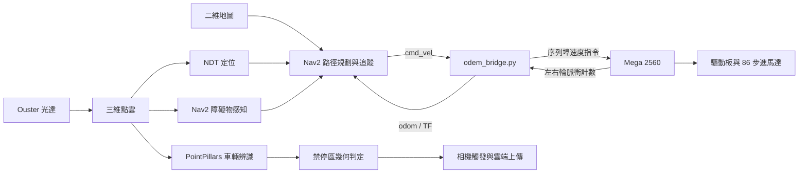

# AMR 光達導航與路側車輛巡檢系統

以 NVIDIA Jetson AGX Xavier、Ouster 光達、Arduino Mega 2560、馬達驅動板與 86 步進馬達組成的 AMR。ROS 2 串接 NDT 定位、Nav2 導航、差速底盤橋接，以及 PointPillars 車輛辨識與禁停區事件判定。

**目前狀態：專題歷史程式與文件整理版；原車已拆除，此整理版未在乾淨環境重建或重新實車驗證。** 本目錄由既有備份挑選並複製程式及資源，保留原始參數與版本線索。Mega 韌體已補齊；部署版本、完整接線及雲端接收端仍待確認；已知問題集中在 [缺漏與待確認事項](docs/檔案缺漏與待確認事項.md)。安裝步驟供日後重建參考。使用者說明大部分參數曾依實車情況校正；無法補測的資料保留為歷史缺口，不作為本次文件交付的前提。

## 功能與資料流



- NDT 使用三維 PCD 地圖配準；Nav2 使用二維佔據網格，兩者需共用一致的 map 基準。
- 使用者確認兩個地圖檔名對應不同場地。啟動紀錄 [run.md](fish/ros2_ws/run.md) 為 Nav2 → nav_gui → map.sh，因此 [室外調查](docs/室外導航無法移動_調查報告.md) 已將「導航晚加入漏收地圖」降為備選，優先查實際 PCD、初始位姿與 TF；尚未證實歷史根因。
- TF 主幹為 `map → odom → base_link → os_lidar`。
- 車輛辨識與導航共用點雲。`/violation/nav_target` 已有發布端，轉為 Nav2 任務的接收端尚未確認。
- 車體回傳的是左右輪編碼器累積計數，已由使用者及 Mega 韌體確認。

完整說明見 [架構與資料流](docs/AMR架構與資料流.md)、[控制系統報告](docs/控制系統報告.md)；另附 [前次控制章節 PDF](output/pdf/114-2專題報告_控制章節更新版.pdf)（尚未同步本次硬體補充，以 Markdown 為準）。硬體尺寸、腳位及實車設定見 [硬體與韌體](docs/硬體與韌體.md)。

關於編碼器、`/odom`、IMU 是否參與定位，以及 Nav2 planner／controller 與車體參數來源，見 [三題答覆與程式依據](docs/AMR里程計_IMU與控制架構答覆.md)。

## 目錄

```text
github/
├── README.md                       # 本說明
├── ros2_ws/                        # 六個主要控制入口、導航設定、URDF、地圖
│   └── src/
│       ├── lidar_localization_ros2/ # 現有 NDT 定位原始碼
│       ├── ndt_omp_ros2/            # NDT 相依套件
│       ├── ouster-ros/              # ros2 分支驅動候選，含 SDK 原始碼
│       └── pcd2pgm-main/            # 選用：三維地圖轉二維地圖
├── ous/                            # 既有光達腳本與 ros2-foxy 驅動版本
├── fish/ros2_ws/
│   ├── src/                        # 車輛辨識與 C++ 禁停區判定
│   ├── OpenPCDet/                  # 本地修改版，含 CUDA 原始碼
│   ├── weights/                    # 已複製的預訓練權重
│   ├── violation_area/             # zones.yaml
│   └── camera_uploader_node.py
├── config/                         # 使用者提供的實車辨識參數 YAML
├── firmware/                       # Mega 2560 sketch 與編譯準備
├── agv.stl                         # 車體模型
├── docs/                           # 安裝、驗證、缺漏、來源與檔案清單
├── reference/                      # 已部署定位設定快照、上游修改差異
├── requirements/                   # Python 依賴分組，尚未鎖版
├── tools/                          # 靜態檢查與原機版本蒐集工具
└── output/pdf/                     # 已更新控制章節的專題報告
```

`build/`、`install/`、`log/`、`.git`、快取及已編譯的 `.so` 沒有複製。必要的定位 launch／參數部署快照另存於 `reference/`，不當成可重建的原始碼。兩套 Ouster 驅動用於保留版本差異，**同一 ROS 環境只選一套建置與啟動**。

## 收錄狀態與已知限制

目前已收錄可從本地備份取得的主要控制程式、Mega 韌體、定位／辨識來源、兩套 YAML／PGM 地圖、兩份 PCD、STL、權重、實車辨識參數及歷史啟動紀錄。安裝、架構、硬體與排錯文件也放在本目錄。

[檔案缺漏與待確認事項](docs/檔案缺漏與待確認事項.md) 是正式隨附文件，保留已釐清資訊、真正未找到的檔案、程式問題，以及拆車後無法補測的歷史資料缺口。主要未決項目為 Ouster `sensor.launch.xml` 確切部署版本、GAS 接收端、違停目標轉 Nav2 的接收端、原機依賴版本與校正紀錄；現有 5 項靜態程式錯誤亦尚未修復。

「備份已收錄」不等於「安裝後可直接完整運行」。整體 LICENSE 與部分資源發布條件尚待團隊確認，詳見 [授權狀態](LICENSE_STATUS.md)；最新檔案與檢查結果見 [整理與檢查結果](docs/整理與檢查結果.md)。

## 硬體與環境

| 項目 | 已知資訊 | 待補資訊 |
|---|---|---|
| 主機 | NVIDIA Jetson AGX Xavier，Ubuntu 20.04（使用者確認） | JetPack、L4T、CUDA 版本 |
| ROS | ROS 2 Foxy（使用者確認） | 原機套件精確版本；備份內其他 ROS 版本來源與 Foxy 的相容性 |
| 光達 | 原報告記載 Ouster OS1 32s；原腳本 IP `169.254.70.240` | 硬體修訂／韌體、網卡與點雲 frame |
| 底盤 | Mega 韌體已收錄；JMC 86J18156EC-1000-LS-01、內建 1000 線編碼器、1600 細分，10 英吋驅動輪 | 實車驅動板型號、編碼器至 Mega 接法、輪距、傳動比及每輪有效計數 |
| 馬達／座標 | 輸出軸 Ø14 mm；STL 原點為 O，圖右側為前進 +x | 現有 Nav2 footprint 軸向不符，參考修正值見 [硬體文件](docs/硬體與韌體.md) |
| 通訊 | 速度與脈衝計數經 `/dev/ttyUSB0`、115200 bps | 穩定裝置名稱與權限 |
| GPU 辨識 | OpenPCDet、PointPillars、nuScenes 權重 | PyTorch／torchvision／spconv 與 CUDA 相容組合 |

馬達圖面與配套候選 `2HSS86H-A` 的接線手冊已找到，見 [原廠資料查核](docs/馬達與驅動器資料查核.md)；實車驅動板型號尚未確認。

先在原機執行 `bash tools/collect_environment.sh` 記錄環境；工具只讀版本資訊，不啟動光達或馬達。

## 安裝指引

### 1. 取得資源與設定路徑

目前本地目錄已包含地圖、STL 及權重。遠端 repository 尚未建立，因此不提供虛構的 clone URL。未來從 GitHub 複製本專案時，需安裝 Git LFS 並執行 `git lfs pull`。

在 Linux 專案根目錄設定：

```bash
export AMR_ROOT="$(pwd)"
```

原始程式含 `/home/ntust`、`/home/saitama`、`/opt/OpenPCDet` 等固定路徑；**設定 AMR_ROOT 本身不會讓原始程式自動改用新路徑**。請先依 [設定與路徑對照](docs/CONFIGURATION.md) 修正複本中的實際路徑。

### 2. 還原 Foxy 環境與 Jetson 依賴

實車環境已確認為 **Ubuntu 20.04 + ROS 2 Foxy**。新建相同環境時，先依 [Foxy 官方安裝文件](https://github.com/ros2/ros2_documentation/blob/foxy/source/Installation/Ubuntu-Install-Debians.rst) 設定 ROS 套件來源並安裝 ROS。JetPack、CUDA 及 Python GPU 套件仍需依原機版本還原。

以 **已安裝 Foxy 的 Ubuntu 20.04 環境**為前提，主要依賴如下。本清單尚未在乾淨 Jetson 上執行驗證，套件精確版本與來源仍應由原機紀錄補齊：

```bash
sudo apt update
sudo apt install build-essential cmake git git-lfs \
  python3-pip python3-venv python3-colcon-common-extensions python3-rosdep \
  python3-numpy python3-serial python3-yaml python3-requests python3-opencv \
  libpcl-dev libeigen3-dev libyaml-cpp-dev \
  ros-foxy-navigation2 ros-foxy-nav2-bringup \
  ros-foxy-nav2-regulated-pure-pursuit-controller \
  ros-foxy-robot-state-publisher ros-foxy-tf2-tools \
  ros-foxy-tf2-geometry-msgs ros-foxy-tf2-sensor-msgs \
  ros-foxy-tf2-eigen ros-foxy-vision-msgs ros-foxy-pcl-conversions \
  ros-foxy-pointcloud-to-laserscan ros-foxy-rviz2
source /opt/ros/foxy/setup.bash
```

Nav2 與 RPP 可在 [Foxy 官方套件索引](https://github.com/ros/rosdistro/blob/master/foxy/distribution.yaml) 查到；此索引不代表原機一定採用相同版本。驅動和定位的其他系統依賴透過 `rosdep` 核對，既有 local-prefix 部署保留原有前綴。備份內含 Humble 等版本的來源／文件，仍需核對它們能否在 Foxy 重建，不能混合載入不同發行版。

### 3. Python 與辨識相依套件

| 用途 | 依賴與安裝方式 |
|---|---|
| 底盤橋接 | ROS 的 rclpy、訊息套件、tf2_ros，加上 NumPy、pyserial。 |
| 相機上傳 | OpenCV、NumPy、requests；OpenCV 優先使用 Jetson 現有或系統版本。 |
| 選用地圖 GUI | `python3 -m pip install -r requirements/gui.txt`，需確認 ARM64 套件可用。 |
| PointPillars | 先依 [NVIDIA 指引](https://docs.nvidia.com/deeplearning/frameworks/install-pytorch-jetson-platform/index.html) 安裝與 JetPack 相容的 PyTorch，再匹配 torchvision、spconv 和 OpenPCDet 依賴。 |

`requirements/base.txt` 與 `requirements/perception.txt` 提供依賴分組，尚未宣稱為可重現的鎖版清單。**不要直接在 Jetson 使用未指定版本的 `pip install torch torchvision`**。NumPy 體素化備援只替代部分前處理，其他模型模組仍匯入 spconv，CUDA 擴充也需重新編譯。

GPU 軟體組合確認後，安裝本地修改版 OpenPCDet：

```bash
python3 -m pip install -r requirements/perception.txt
python3 -m pip install --no-build-isolation --no-deps -e fish/ros2_ws/OpenPCDet
python3 -c "import torch; print(torch.__version__, torch.version.cuda, torch.cuda.is_available())"
```

完整依賴分類、colcon 建置與環境蒐集見 [INSTALL.md](docs/INSTALL.md)。

### 4. 建置 ROS 工作區

先執行 `python3 tools/check_project.py` 查看靜態檢查結果，再依 [INSTALL.md](docs/INSTALL.md) 選定 Ouster 版本、建立定位 overlay 及辨識工作區。現有辨識 launch 語法、舊 console entry point 和 NDT 函式庫匯出問題仍待處理，尚未提供「已通過」的建置指令或徽章。

## 設定與啟動

原始六個控制入口位於 `ros2_ws/`，啟動前應完成環境與路徑校正。各常駐節點使用獨立終端；每個終端先載入相同 ROS 發行版與已建置的工作區。

下表依 [原始 run.md](fish/ros2_ws/run.md) 記錄順序整理，取代前版自行排列的建議順序。這是歷史操作筆記，不是保證可直接重現的啟動腳本；原紀錄的相對路徑需依各終端位置解析。

| 紀錄順序 | 入口／命令 | 作用 |
|---|---|---|
| 1 | 在 ros2_ws 執行 `source fix.sh`，再 `python3 odem_bridge.py` | 原機網路設定、Mega 橋接與里程計。 |
| 2 | `source myagv.sh` | 發布車體與光達固定座標。 |
| 3 | 在 ous 執行 `source lidar.sh` | 啟動 Ouster 驅動。 |
| 4 | 在 ros2_ws 執行 `source laser.sh` | 將點雲轉為 /scan；目前主要 Nav2 障礙物設定直接讀點雲。 |
| 5 | `source local.sh` | 啟動 NDT 定位。 |
| 6 | `source nav1.sh` | 啟動 Nav2。 |
| 7 | `python3 nav_gui.py` | 啟動自製地圖與導航介面。 |
| 8 | `source map.sh` | 啟動二維地圖伺服器。 |
| 9 | 辨識 launch → 違停判定 → 相機上傳 | 詳細原始命令見 run.md；已知舊 launch 問題仍須處理。 |

紀錄明確是導航先、地圖後；命令先執行不代表節點已就緒。日後重建仍應核對有效地圖、TF 與生命週期狀態，確認完成後再下達目標。Foxy 的 `map_subscribe_transient_local:=true` 可作為移除啟動順序依賴的設定改善，但不能宣稱已解決歷史故障，見 [調查報告](docs/室外導航無法移動_調查報告.md)。

Mega 韌體已確認有 500 ms 指令逾時歸零邏輯，實際停止延遲仍待驗證。底盤驗證先核對接線及停止方式，韌體編譯準備見 [firmware/README](firmware/README.md)。`fix.sh` 會改動網卡速率，需先核對網卡與感測器需求，不列為所有電腦必執行的步驟。

辨識程式預設門檻為 0.1；實車通用及 car／truck／bus 四項門檻皆設定為 0.4。使用者提供的 ROI、高度修正與時間戳設定已收錄至 [config/vehicle_detector.yaml](config/vehicle_detector.yaml)，手動指令和啟動時載入方式見 [CONFIGURATION](docs/CONFIGURATION.md)。此檔需明確載入，並不自動改寫原始預設。

辨識功能的啟動說明如下，**目前需先修復已記錄的 launch 問題並完成模型載入驗證**：

```bash
source "$AMR_ROOT/fish/ros2_ws/install/setup.bash"
ros2 launch pub_model_vehicle_detector pub_model_detector.launch.py
ros2 launch violation_detector violation_detector.launch.py
```

相機上傳屬選用功能。公開複本已將原固定 GAS 網址改為讀取 `AMR_GAS_URL`；範例見 [`.env.example`](.env.example)。程式不會自動載入 `.env`，需由 shell 匯出變數。尚未取得 GAS 接收端原始碼與部署設定時，不啟動此功能。

## 驗證與排錯

```bash
ros2 topic list
ros2 topic hz /ouster/points
ros2 topic hz /odom
ros2 run tf2_ros tf2_echo map base_link
ros2 run tf2_tools view_frames
```

預期可看到 `/ouster/points`、`/odom`、`/map` 及主 TF 鏈。詳見 [驗證與排錯](docs/VALIDATION.md)。依使用者對歷史實車測試的回憶，點雲 topic 發布約 **3.75 Hz**，辨識平均更新率 **高於 1 Hz**；精確平均與目前未取得原始日誌，詳見 [歷史實車測試紀錄](docs/歷史實車測試紀錄.md)。Mega 回報約 20 Hz 等級，橋接的 50 Hz 計時器不代表新編碼器資料率。

目前完成的是檔案盤點、複製校驗與靜態檢查，沒有宣稱 ROS 建置、GPU 推論、實車導航或雲端上傳已通過。

## 資源、授權與貢獻

- [資源清單與 Git LFS](docs/ASSETS.md)：地圖、模型、權重的大小與 SHA-256。
- [第三方來源](THIRD_PARTY_NOTICES.md)：保留上游 LICENSE、版本線索及本地修改差異。
- [授權狀態](LICENSE_STATUS.md)：尚未替整個專案選定 LICENSE；各第三方檔案依其原授權處理。
- [貢獻說明](CONTRIBUTING.md)：回報問題所需資訊、驗證要求與 PR 範本。
- [開源專案待辦](docs/開源專案完整性清單.md)：將必要補件與建議改善分開記錄。
- [收錄範圍](docs/檔案收錄說明.md) 與 [本次檢查結果](docs/整理與檢查結果.md)：哪些檔案已複製、複本差異及驗證範圍。

維護者、正式 repository URL、首個可重現環境版本及實車驗證紀錄，待專題團隊補上。
