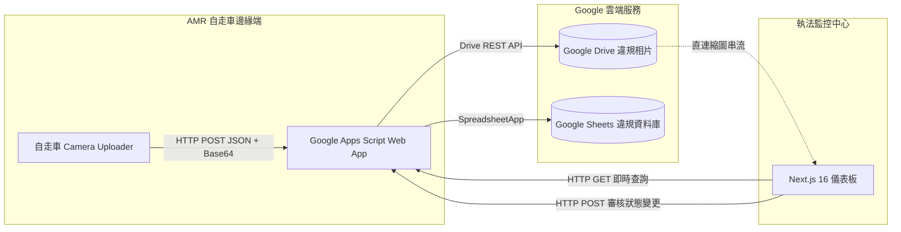

# LiDAR-based Illegal Parking Detection AMR — Web Monitoring Dashboard & Cloud Backend

> 自走車 3D 光達違規停車巡檢系統 — 雲端執法監控中心與後端微服務  
> 本倉庫主要包含本專案之雲端監控儀表板 (Web Dashboard) 與無伺服器後端 (Serverless Backend / Google Apps Script)。自走車底盤控制、導航定位與 3D AI 感知等 ROS 2 端代碼將於後續整理發布。

---

## 系統總覽 (Overview)

本子系統為巡檢自走車閉環取證的關鍵最後一哩路。當 AMR 自走車在邊緣端透過 3D 光達（Ouster OS1）結合 PointPillars 模型與空間多邊形判定車輛違停時，會驅動相機拍照取證，並將影像與 GIS 經緯度透過 HTTP POST 發送至雲端。

本倉庫包含兩大核心模組：
1. **Google Apps Script (GAS) 後端微服務** (`backend_gas/`)：提供零維護成本的 Serverless API，自動將違規照片存入 Google Drive、結構化資料寫入 Google Sheets。
2. **現代化響應式監控儀表板** (`frontend/`)：基於 Next.js 16 + React 19 + Leaflet GIS 打造之深色系執法儀表板，支援即時事件串流、地圖定位、照片預覽與人工在環（Human-in-the-Loop）違停審核機制。



---

## 核心功能特色 (Key Features)

* **互動式 GIS 地圖聯動 (Interactive Map)**
  * 採用 Leaflet 開源地圖，自動由 OSM / Google Maps URL 解析違規事件之精確 GPS 經緯度。
  * 支援點擊卡片地圖平滑平移（Pan/Fly-to）並彈出縮圖與詳細地址標記。
* **即時違規事件卡片串流 (Real-time Event Stream)**
  * 顯示事件 ID、發生時間、禁停區域名稱、台灣當地路段門牌與處理狀態標籤（待審核、已確認、已駁回）。
* **雲端違規照片快速預覽 (High-res Photo Preview)**
  * 自動解析 Google Drive 檔案 ID，繞過第三方 Cookie 限制使用高速縮圖端點渲染現場取證照片。
* **人工在環審核機制 (Human-in-the-Loop Audit)**
  * 提供「確認違停」與「誤判剔除」單鍵審核功能，審核結果即時異步同步回 Google Sheets 資料庫，避免重複處置。
* **零洩漏環境變數架構 (Security by Design)**
  * 前端全面採用 `NEXT_PUBLIC_GAS_API_URL` 環境變數隔離機密；後端支援 Google Drive Folder ID 抽象化，程式庫不含任何寫死金鑰。

---

## 目錄結構 (Repository Structure)

```text
.
├── backend_gas/               # Google Apps Script 無伺服器後端
│   ├── Code.js                # 後端核心邏輯 (doPost 上傳/審核, doGet 查詢)
│   ├── appsscript.json        # Apps Script 資訊清單與 OAuth 授權權限宣告
│   ├── .clasp.json            # clasp CLI 專案設定檔範本
│   └── README.md              # 後端設定與部署說明
├── frontend/                  # Next.js 現代化監控中心儀表板
│   ├── app/
│   │   ├── components/        # 核心元件 (MapView 地圖、EventCard 卡片、DashboardClient)
│   │   ├── globals.css        # 深色科技風設計系統 CSS Token
│   │   ├── layout.tsx         # 根佈局設定
│   │   ├── page.tsx           # 儀表板主入口 (SSR 資料抓取)
│   │   └── types.ts           # TypeScript 資料結構定義
│   ├── public/                # 靜態資源
│   ├── .env.example           # 環境變數設定範本
│   ├── next.config.ts         # Next.js 伺服器與 Google 圖片域名安全白名單
│   ├── package.json           # 依賴清單 (Leaflet, React-Leaflet 等)
│   └── README.md              # 前端建置與開發說明
├── docs/                      # 說明文件與安全性參考
├── LICENSE                    # MIT 開源授權條款
└── README.md                  # 本說明文件
```

---

## 快速上手指南 (Quick Start)

### 1. 後端部署 (Google Apps Script)
1. 建立一個新的 [Google Sheets](https://sheets.new)，並在 Google Drive 建立一個用於存放違規相片的資料夾。
2. 進入試算表工具列之 **擴充功能 > Apps Script**。
3. 將 `backend_gas/Code.js` 與 `backend_gas/appsscript.json` 的程式碼貼入編輯器中。
4. 將 `Code.js` 第 6 行的 `DRIVE_FOLDER_ID` 替換為你的 Google Drive 資料夾 ID。
5. 點擊右上角 **部署 > 新部署**：
   * 類型選擇：**網路應用程式 (Web App)**
   * 執行身分：**我 (Me)**
   * 誰可以存取：**所有人 (Anyone)**
6. 複製產生的 **網頁應用程式網址 (Web App URL)**，格式如：
   `https://script.google.com/macros/s/AKfycb.../exec`

### 2. 前端啟動 (Next.js Dashboard)
```bash
# 1. 進入前端目錄
cd frontend

# 2. 安裝相依套件
npm install

# 3. 設定環境變數
cp .env.example .env.local
# 編輯 .env.local，將剛才複製的 GAS 網址貼入：
# NEXT_PUBLIC_GAS_API_URL=https://script.google.com/macros/s/YOUR_GAS_DEPLOYMENT_ID/exec

# 4. 啟動本地開發伺服器
npm run dev
```
瀏覽器打開 `http://localhost:3000` 即可看到即時違停監控儀表板。

若要編譯正式發布版本：
```bash
npm run build
npm run start
```

---

## REST API 規格 (API Specifications)

後端微服務以單一 Web App URL 提供標準 RESTful 介面：

| 方法 | 路由 / Action | 說明 | 參數 / Payload 範例 |
|---|---|---|---|
| **GET** | `/` | 取得所有違規事件清單 | 回傳 JSON 陣列 `[{ id, timestamp, zone, maps_url, address, image_url, status, notes }, ...]` |
| **POST** | `action: "create"` (預設) | 自走車上傳新事件與照片 | `{"event_id": "EVT-...", "timestamp": "...", "zone_name": "...", "maps_url": "...", "address": "...", "image_base64": "..."}` |
| **POST** | `action: "update_status"` | 審核人員更新案件狀態 | `{"action": "update_status", "event_id": "EVT-...", "status": "已確認"}` |

---

## 開源授權 (License)

本專案採用 [MIT License](LICENSE) 條款開源授權。
