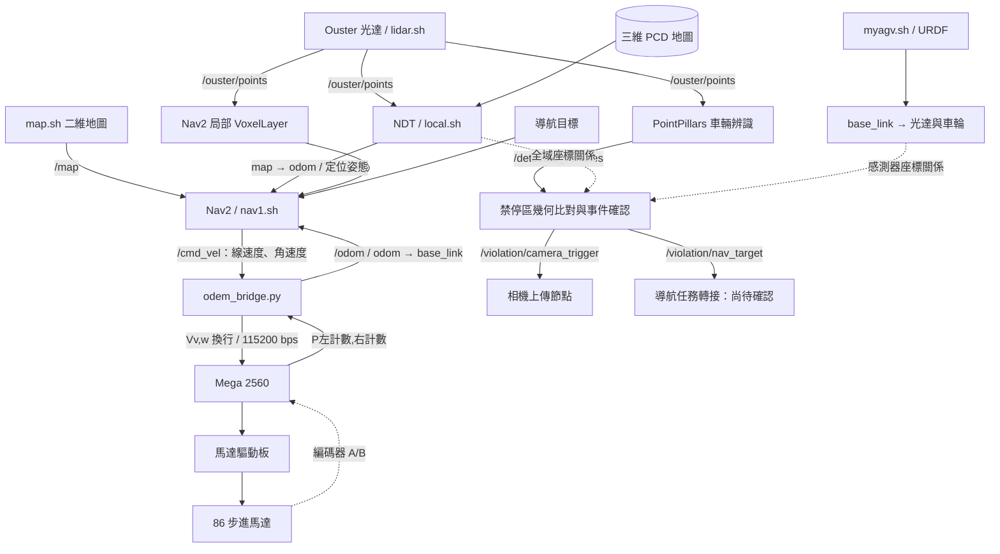

# AMR 軟體架構與資料流

本文件供 GitHub 架構說明與後續報告維護使用，更新日期為 2026-09-24，已補入 Mega 韌體、實車資訊與 IMU 查核。依使用者指定的六個主要程式追查，再以《專題技術報告.md》補充光達車輛辨識。原車已拆除，參數多曾依實車情況調整；歷史效能回報與程式設定分開記錄。此次分析範圍為檔案與設定的靜態閱讀，未在 Windows 備份資料夾執行 ROS、連接實車或修改控制程式。

## 交付內容與範圍

- `控制系統報告.md`：可編輯的正式報告文字，包含兩張 Mermaid 架構圖。
- `../output/pdf/114-2專題報告_控制章節更新版.pdf`：將原 PDF 第 4–7 頁的控制章節替換為新內容，保留第 1–3、8–17 頁。此 PDF 為前次交付快照，尚未同步本次硬體與門檻資訊，以 Markdown 為最新內容。
- 原始 `專題技術報告.md` 與原 PDF 未覆寫。原 PDF 其餘章節仍保留原有說法；其中辨識與違停章節的舊參數不代表本次核對結果。
- [檔案缺漏與待確認事項.md](檔案缺漏與待確認事項.md)：集中記錄缺檔、版本差異與尚未確認的介面，供後續補件處理。

## 主要架構

Jetson AGX Xavier 在 Ubuntu 20.04 上執行 ROS 2 Foxy 上層控制，主機與環境已由使用者確認。光達點雲有三條用途：NDT 全域定位、Nav2 局部障礙物地圖、PointPillars 車輛辨識。Nav2 根據導航目標、全域地圖與車體姿態輸出速度，經序列埠送給 Mega 2560，再由 Mega 控制驅動板與 JMC 86J18156EC-1000-LS-01 閉環步進馬達（輸出軸 Ø14 mm、內建 1000 線編碼器）。底盤回傳左右輪編碼器累積計數，供里程計更新。

## 六個主要入口

以下為來源索引，路徑相對於本文件。使用者描述中的 `Odem_beidge.py` 對應到目前找到的 `odem_bridge.py`。

| 入口 | 主要輸入 | 輸出與責任 |
|---|---|---|
| [odem_bridge.py](../ros2_ws/odem_bridge.py) | `/cmd_vel`、序列埠 `P左,右` | 傳送 `V線速度,角速度`；發布 `/odom`、`odom → base_link`。 |
| [myagv.sh](../ros2_ws/myagv.sh) | [myagv.urdf](../ros2_ws/myagv.urdf) | `robot_state_publisher` 發布 `base_link → os_lidar/left_wheel/right_wheel` 固定關係。 |
| [lidar.sh](../ros2_ws/lidar.sh) | Ouster 光達網路串流 | `/ouster/points`；`TIME_FROM_ROS_TIME`、`use_sim_time=false`、`pub_static_tf=false`。另有 [ous/lidar.sh](../ous/lidar.sh) 同用途版本。 |
| [local.sh](../ros2_ws/local.sh) | 點雲、PCD 地圖、里程計 TF | NDT 定位、`map → odom`、`/localization/pose_with_covariance`。 |
| [nav1.sh](../ros2_ws/nav1.sh) | 地圖、TF、點雲、導航目標 | Nav2 規劃與追蹤，輸出 `/cmd_vel`。 |
| [map.sh](../ros2_ws/map.sh) | [mymap.yaml](../ros2_ws/mymap.yaml) 與 PGM | Lifecycle Manager 啟用 Map Server，發布 `/map`。 |

TF 主幹為 `map → odom → base_link → os_lidar`。靜態外參應由車體模型管理，與使用者指定架構一致。

## IMU 的使用範圍

Ouster 驅動設定包含 IMU 輸出，但主要部署 NDT YAML 為 `use_odom=true`、`use_imu=false`、`use_imu_preintegration=false`，主 local.sh 未將其開啟。因此保存的主流程為 LiDAR 定位搭配編碼器里程計，未啟用 IMU 融合／預積分。IMU remap、訂閱介面或靜態 TF 的存在不能證明實際融合。另找到 IMU 時間戳處理程式與未列 IMU 輸入的 EKF 候選檔，均不在主要啟動紀錄中；是否曾錄製本車 IMU 無法確認。完整依據及可轉貼摘要見 [里程計、IMU 與控制架構答覆](AMR里程計_IMU與控制架構答覆.md)。

## 技術與參數摘要

| 模組 | 技術 | 核對的代表設定 |
|---|---|---|
| 底盤橋接 | Python、rclpy、pyserial、差速里程計 | 輪徑 0.26 m、輪距 0.85 m、現有 ppr=1600（待與 1000 線編碼器解碼／傳動比核對）、115200 bps；讀取及發布計時器各 50 Hz。 |
| Mega 韌體 | AccelStepper、差速換算、STEP/DIR、編碼器中斷 | 加速度 50 steps/s²；計數約 20 Hz 回報；指令逾時 500 ms，停止效果待驗證。 |
| 車體模型 | URDF、robot_state_publisher、TF2 | 光達相對 `base_link` 為 `(-0.375, 0, 1.122)` m；非地面絕對高度。 |
| 定位 | NDT_OMP、Voxel Grid 降採樣、局部地圖裁切 | NDT 3.5 m、最多 20 次迭代、8 執行緒；降採樣 0.3 m、距離 0.5–25 m、地圖半徑 30 m、姿態發布 10 Hz。 |
| 全域規劃 | NavFn / Dijkstra | `use_astar=false`；全域成本地圖 StaticLayer + InflationLayer。 |
| 路徑追蹤 | Regulated Pure Pursuit | 5 Hz、期望速度 0.25 m/s、固定前視距離 1.5 m；曲率速度調節開啟。 |
| 局部感知 | VoxelLayer 直接接收 PointCloud2 | 6 × 6 m、解析度設定 0.05 m、5 Hz；高度 0.15–2.0 m、標記最遠 4.0 m。 |
| 避障成本 | 車體 footprint、InflationLayer | 局部膨脹半徑 1.15 m、全域 0.7 m；不等同保證的實際最小距離。 |
| 車輛辨識 | OpenPCDet、PointPillars、nuScenes 預訓練權重 | ROI X -10–15、Y -12–12、Z -2.5–3 m；Z 修正 0.57 m；程式預設門檻 0.1；實車手動設定 0.4（使用者確認）。 |
| 辨識後處理 | 幾何與朝向篩選、Centroid NMS、跨幀追蹤 | NMS 1.5 m；累積命中 5 次；超過 3 幀失配移除；關聯距離依時間差調整為 3.5–8 m。 |
| 巡檢判定 | TF2、中心與四角採樣、Ray-Casting、EMA | 確認時間 3 s、冷卻 30 s、重複事件距離 2 m；原始碼匹配門檻 1.2 m、框半長寬外擴 1.0 m。 |

數值以檔案設定為主；門檻 0.4 則是使用者確認的實車手動覆寫值。使用者回憶先前點雲 topic 發布約 3.75 Hz、辨識平均更新率高於 1 Hz；精確辨識值與量測日誌未留存，見 [歷史實車測試紀錄](歷史實車測試紀錄.md)。大部分參數曾依實車調整，現保留部署值；設定頻率不當作實測性能；Mega 約 20 Hz 計數回報與 Jetson 50 Hz 重發計時器需區分。NavFn 與 RPP 的原理可參考 [Nav2 NavFn 官方文件](https://docs.nav2.org/jazzy/configuration_and_development/configuration_guide/planners_plugins/configuring_navfn/) 與 [RPP 官方說明](https://github.com/ros-navigation/navigation2/blob/main/nav2_regulated_pure_pursuit_controller/README.md)；本專案使用哪些參數仍以本地程式為依據。

## 辨識資料如何銜接

1. [detector_node.py](../fish/ros2_ws/src/pub_model_vehicle_detector/pub_model_vehicle_detector/detector_node.py) 解包點雲，將強度除以 255 並限制於 0–1，裁切 ROI、下移 Z 0.57 m，補入零值時間特徵，交由 PointPillars 推論；輸出框再加回 Z 偏移。
2. 以高度、長寬比、各車種尺寸及與輸入座標 X 軸的朝向角篩選候選框，再去除重複框、累積跨幀命中。此處沒有證據支持「完全消除誤判」或固定 2 ms 解包等效能說法。
3. `/detected_vehicles` 沿用輸入點雲的 `header.frame_id`，不能僅因設定 `target_frame=base_link` 就宣稱整批點雲已轉成車體座標。`sync_time_stamp=true` 在 callback 開始以目前節點時間改寫 stamp，輸出框繼承此時間戳；這不等於保留原始採樣時間或消除延遲。後續由 [violation_detector_node.cpp](../fish/ros2_ws/src/violation_detector/src/violation_detector_node.cpp) 依 header 透過 TF 轉至 `map`。
4. 禁停區由 [zones.yaml](../fish/ros2_ws/violation_area/zones.yaml) 載入，採 [zone.hpp](../fish/ros2_ws/src/violation_detector/include/violation_detector/zone.hpp) 的射線法檢查五個採樣點。`zone_buffer_m` 實作為外擴車框半長寬，並非直接對禁停區多邊形做 buffer；五點法也不等同完整多邊形相交測試。
5. 事件確認後發布視覺化、相機觸發及觀測目標點。相關計時屬於專題事件規則；目前程式並沒有藉此證明車輛速度為零，也不應把 3 s 寫成法律上的違停判定門檻。

## 與舊報告的差異及待確認項目

| 項目 | 本次整理採用的說法／原因 |
|---|---|
| 脈衝來源 | 已取得指定 Mega 韌體，並確認為閉環步進編碼器回授；A 改變時計數，非四倍頻。腳位與協定見 [硬體與韌體](硬體與韌體.md)。 |
| 編碼器與細分 | 使用者確認馬達內建 1000 線編碼器、1600 細分；若原始 A 相每軸圈 1000 週期，目前解碼理論為 2000 次／軸圈。每輪計數仍需乘上傳動比並核對訊號分頻，不能把 1600 細分當成里程計倍率。 |
| 重複橋接程式 | 以 `ros2_ws/odem_bridge.py` 為主；根目錄 `odem_bridge1.py` 與 `motor_bridge.py` 的輪徑、輪距、通訊協定不同，不混入主流程。 |
| NDT 地圖 | 使用 PCD 三維點雲，非直接拿二維 OccupancyGrid 做 NDT。`local.sh` 會透過套件索引載入安裝版本，已比對 `src` 與 `install` 中的 NDT 參數。 |
| 二維地圖場景 | 使用者確認兩檔是不同場地的圖。`map.sh` 載入 `mymap.yaml`，官方 Foxy navigation_launch 不使用 nav1 傳入的 map 引數。[run.md](../fish/ros2_ws/run.md) 記錄導航先、GUI 次之、地圖後啟動，因此 QoS 晚加入漏收已降為備選；優先查實際定位地圖、初始位姿與 TF。見 [室外導航調查](室外導航無法移動_調查報告.md)。 |
| /scan | 有 `laser.sh` 轉換工具，但現有主成本地圖輸入是 `/ouster/points`，故不列為必要導航中介。 |
| 控制器 | 現有設定為 RPP、5 Hz；原 PDF 的 DWB／TEB、20 Hz 屬於泛用介紹，已替換。 |
| 靜態 TF 版本 | 根據指定架構，由 URDF 管理光達外參。安裝版 localization launch 仍預設另發 `base_link → os_sensor` 零位移；工作區根目錄 launch 則預設關閉額外光達 TF。發布版本須確認實際載入檔與光達 frame。 |
| 幾何數值 | URDF 車輪視覺模型半徑 0.075 m、中心距約 0.82 m；里程計則用輪徑 0.26 m、輪距 0.85 m。實車輪徑標稱 10 英吋（0.254 m），原點為前方驅動輪觸地連線中點。圖示外框 955 × 902 mm；STL 原點同為 O、圖右側為前進 +x，現有 footprint 軸向與已確認定義不符，參考修正值見硬體文件；外框寬不等於輪距。 |
| ROS 時間 | `TIME_FROM_ROS_TIME` 是驅動時間戳來源，與 `use_sim_time=false` 一起使用；並不是啟用模擬 `/clock`。local.sh 額外傳入同名參數，但查閱的 localization launch 未宣告或使用它。 |
| 辨識門檻與追蹤 | 程式預設 0.1；實車通用與三車種門檻皆手動設為 0.4，已保存 [部署 YAML](../config/vehicle_detector.yaml) 與指令。`hits` 失配時不歸零，故為累積 5 次命中，非嚴格連續 5 幀。 |
| 違停導航 | 查到 `/violation/nav_target` 發布端；在已檢查的主要程式與辨識套件中未找到轉成 Nav2 action 的接收端，保留為待確認介面。 |
| 啟動檔完整性 | `fish/ros2_ws/src/pub_model_vehicle_detector/launch/pub_model_detector.launch.py` 第 72 行附近有殘留參數區塊，Python AST 解析失敗。使用者確認舊節點是筆電測試殘留；Node 雖註解，parameters 仍有未註解內容。此次記為舊入口清理項目，未更動 source。 |

主要參數來源：[導航 YAML](../ros2_ws/my_nav2_params.yaml)、[NDT YAML](../ros2_ws/src/lidar_localization_ros2/param/nav2_ndt_urban.yaml)、[安裝版定位 launch](../reference/deployed_localization/launch/nav2_lidar_localization.launch.py)、[NumPy 體素化備援](../fish/ros2_ws/OpenPCDet/pcdet/datasets/processor/data_processor.py)。

## GitHub 整理範圍

這份資料夾含工作區備份、第三方套件與產生檔，不能僅因存在就視為本系統必用模組。後續整理 GitHub 可優先保留六個啟動入口、URDF、導航與定位設定、自製橋接程式、辨識及違停節點與文件；第三方套件列出來源和版本，模型權重、地圖與 rosbag 另列取得方式。`build/`、`install/`、`log/`、`__pycache__/` 及其他控制方案不需全部納入主要專案說明。本次未刪除檔案、建立遠端 repository 或上傳 GitHub。
