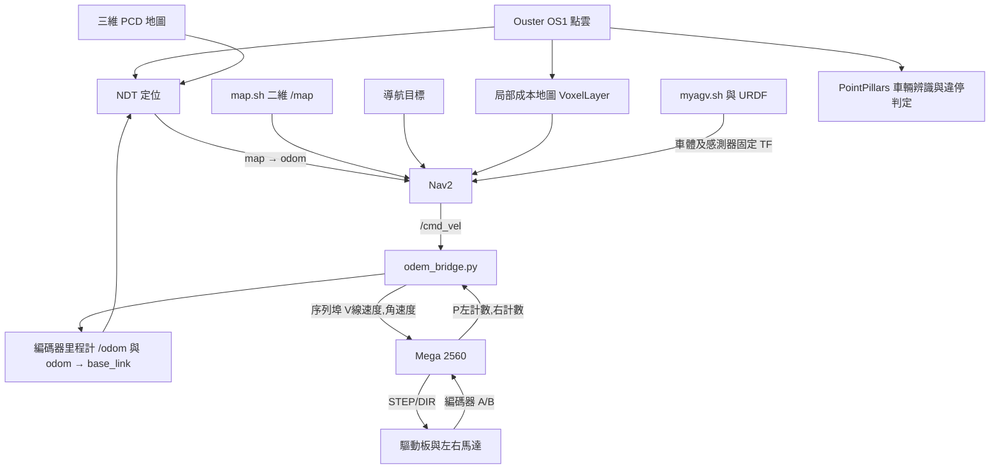

# AMR 里程計、IMU 與控制架構答覆

更新：2026-09-24。依使用者已確認的硬體、保存的原始碼、部署設定與啟動紀錄整理。原車已拆除，以下說明保存版本的設計與設定，不代表目前有實車在線，也不宣稱已重現當年的室外故障。

## 1. 有沒有 wheel encoder／wheel odometry？ROS 有沒有 /odom？

**有。馬達內建編碼器，且已有編碼器里程計與 `/odom` 發布程式。**

- 左右 JMC 86J18156EC-1000-LS-01 閉環步進馬達內建 1000 線編碼器。這是馬達軸編碼器，透過傳動關係估算車輪運動，並非另加在輪轂的獨立感測器。
- [Mega 韌體](../firmware/mega2560/final_copy_20260923083515/final_copy_20260923083515.ino) 讀取左右編碼器 A/B 訊號，以 `P左累積計數,右累積計數` 經 115200 bps 序列埠回傳 Jetson。
- [odem_bridge.py](../ros2_ws/odem_bridge.py) 依左右計數增量計算差速里程計，發布 `nav_msgs/Odometry` 的 `/odom`，包含 x、y、yaw 與線／角速度；同時發布 `odom → base_link` TF。
- 橋接讀取／發布計時器設為 50 Hz，Mega 回報間隔約 50 ms（程式設定約 20 Hz）。這些不是實測頻率；以 50 Hz 發布也不等於每次都有新的編碼器資料。

剩下的是尺度校正的不確定性：橋接使用輪徑 0.26 m、輪距 0.85 m、`ppr=1600`。驅動器 1600 細分屬於命令端，不能直接等同編碼器每輪一圈的有效計數。依目前 A 相雙邊緣計數程式，在 1000 週期／編碼器軸圈且訊號未分頻的條件下，理論為 2000 次／軸圈，還需乘上傳動比；缺少歷史校正紀錄，因此保留原部署值並記錄差異。這不影響「已有編碼器里程計」的判斷。

## 2. Ouster OS1 IMU 是否實際使用／記錄？

**驅動設定包含 IMU 輸出；保存的主要 NDT 部署設定關閉 IMU 使用與預積分。是否曾錄製 IMU 資料，現有資料不足以確認。**

| 層次 | 可確認的內容 | 判斷限制 |
|---|---|---|
| 驅動輸出 | Ouster `proc_mask` 包含 `IMU`；驅動碼在此旗標開啟時建立 `sensor_msgs/Imu` publisher，於常見 `ouster` namespace 下為 `/ouster/imu`。 | 這是保存設定與程式行為；備份缺少主腳本所呼叫的 `sensor.launch.xml`，不能據此證明當次實車 topic 狀態。 |
| 定位使用 | [部署 YAML](../reference/deployed_localization/param/nav2_ndt_urban.yaml) 為 `use_odom: true`、`use_imu: false`、`use_imu_preintegration: false`；主 [local.sh](../ros2_ws/local.sh) 沒有將 IMU 開啟。 | 主流程依 LiDAR NDT 與編碼器里程計建立定位／TF；不能寫成已啟用 LiDAR–IMU 融合。 |
| 介面與旁支 | 定位 launch 有 IMU topic remap；另找到 `/ouster/imu → /fixed/imu` 時間戳處理程式，以及 EKF 候選檔。 | 有訂閱介面、TF 或處理程式，不等於實車啟用。EKF YAML 僅列 odom／NDT 輸入，沒有 IMU 輸入；兩個旁支均未列在主啟動紀錄。 |
| 資料記錄 | 主 [run.md](../fish/ros2_ws/run.md) 未列錄包指令；本次檢索未找到能確認本車 IMU 實測錄製的 bag 與操作紀錄。 | 不能斷言從未錄過；時間戳程式提到 Bag，也不能證明該資料曾保存或仍在備份中。 |

旁支原檔與來源對照收錄於 [IMU 查核參考](../reference/imu_investigation/README.md)，未併入主啟動流程。使用者回憶的點雲約 3.75 Hz、辨識平均高於 1 Hz，均不是 IMU 更新頻率。

## 3. 實際控制架構、Nav2 與車體參數

主機為 Jetson AGX Xavier，環境為 Ubuntu 20.04／ROS 2 Foxy。完整文件為 [AMR 架構與資料流](AMR架構與資料流.md)，以下為可直接轉貼的摘要。

### Nav2 選用的 planner／controller

依 [nav1.sh](../ros2_ws/nav1.sh) 指向的 [my_nav2_params.yaml](../ros2_ws/my_nav2_params.yaml)：

| 功能 | 設定的實作 | 代表參數 |
|---|---|---|
| 全域路徑規劃 | `nav2_navfn_planner/NavfnPlanner` | `use_astar: false`，使用 Dijkstra；`tolerance: 1.5`。 |
| 路徑追蹤 | `nav2_regulated_pure_pursuit_controller::RegulatedPurePursuitController` | 控制設定 5 Hz、期望線速度 0.25 m/s、固定前視距離 1.5 m。 |
| 全域成本地圖 | StaticLayer + InflationLayer，座標系 `map` | 使用二維 `/map`。 |
| 局部成本地圖 | VoxelLayer + InflationLayer，座標系 `odom` | 直接接收 `/ouster/points` PointCloud2；視窗 6 × 6 m，解析度設定 0.05 m。 |

以上是保存版本所選用的模組，無法證明故障當次所有 Nav2 節點均成功啟用。設定頻率與期望速度不當作實測效能。

### 車體參數從哪裡進入系統？

| 來源 | 用途 | 已保存的代表值 |
|---|---|---|
| [odem_bridge.py](../ros2_ws/odem_bridge.py) 的 ROS 參數 | 編碼器計數換算成里程計 | 輪徑 0.26 m、輪距 0.85 m、`ppr=1600`。 |
| Mega 韌體內的常數 | 線／角速度換成左右輪步進速率 | 輪徑 0.26 m、輪距 0.85 m、`stepsPerRev=1600`。 |
| [myagv.sh](../ros2_ws/myagv.sh) 載入的 [myagv.urdf](../ros2_ws/myagv.urdf) | robot_state_publisher 建立車體、光達、車輪座標關係 | 光達相對 base_link 為 `(-0.375, 0, 1.122)` m；模型兩輪 y 間距 0.82 m。 |
| Nav2 的 `my_nav2_params.yaml` | 全域／局部成本地圖的車體碰撞外框，以及控制參數 | 兩個 costmap 各自設定 footprint，並非自動從 STL 或 URDF 讀入。 |

這些來源彼此獨立，改 URDF 不會同步改里程計、Mega 或 Nav2 外框。使用者已確認原點 O 為兩驅動輪觸地點連線中點，前進為 +x。現存 footprint 與尺寸圖的軸向不一致；10 英吋標稱輪徑與 0.26 m 部署值、0.85 m 部署輪距與 0.82 m 模型值，保留為幾何／校正差異，未擅改程式。詳見 [硬體與韌體](硬體與韌體.md)。

### 室外失敗發生在哪個環節？

**尚未確認。已知歷史現象是室外導航時車輛無法移動，沒有足夠紀錄判定停在定位、規劃、控制器或底盤通訊哪一段。**

- `map.sh` 載入 `mymap.yaml`；`nav1.sh` 帶入 `my_map.yaml`。兩個檔名對應不同場地已由使用者確認；但依已查核的官方 Foxy `navigation_launch.py`，該入口不使用 `map` 引數，也不負責啟動 Map Server，因此不能直接認定「RViz 看一張圖、Nav2 吃另一張圖」。原機安裝版本未完整留存，結論仍有版本限制。
- `run.md` 記錄的是 `nav1.sh → nav_gui.py → map.sh`，因此「導航晚於地圖啟動而漏收 /map」只能列為其他啟動情境的候選，不能當成此紀錄的主要解釋。
- 保存設定中仍有實際載入 PCD、初始位姿、TF／時間戳與 footprint 的核對事項；尤其部分 launch 會以後面的參數字典覆寫 PCD 路徑，僅改某一個 YAML 檔名不一定改到實際載入項目。這些是候選原因，不是已證實根因。
- 缺少故障當次的有效參數、節點啟用狀態、定位／TF、路徑與 `/cmd_vel`／序列埠紀錄，無法把歷史故障定位到單一環節。原車已拆除，未留存項目記為歷史資料缺口。

完整推論與官方來源見 [室外導航無法移動調查報告](室外導航無法移動_調查報告.md)；其他缺漏集中於 [檔案缺漏與待確認事項](檔案缺漏與待確認事項.md)。
