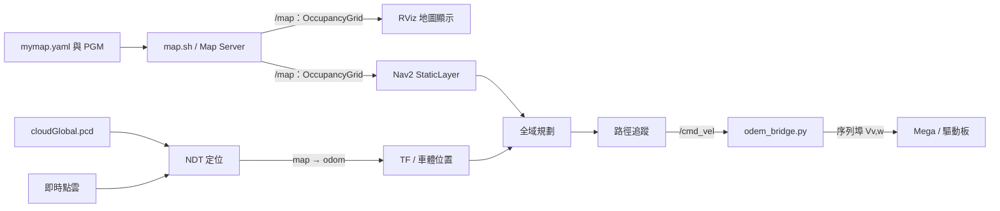

# 室外導航無法移動：地圖、啟動與資料流調查

調查日期：2026-09-23。依使用者確認的 Ubuntu 20.04／ROS 2 Foxy、六個主要入口、現存部署設定，以及 Nav2 官方 Foxy 原始碼進行離線分析。原車已拆除，本次沒有執行 ROS 或重現實車故障。

## 結論與證據強度

**已找到啟動紀錄：導航先開，地圖後開。因此先前列為優先候選的「地圖先發布、導航後加入」需要降為條件式備選。兩個檔名確實是不同場地的圖，但目前主流程沒有證據表明 RViz 與 Nav2 因此各自讀取一張。**

- 已確認：`map.sh` 啟動 Map Server，載入 `mymap.yaml`；`nav1.sh` 呼叫的是 `navigation_launch.py`。官方 Foxy 的這個 launch 不建立 Map Server，也不讀取 `map` 引數。修改 `nav1.sh` 的 `map:=...` 不會替換 `/map`。
- 已確認上游行為：官方 Foxy launch 將 `map_subscribe_transient_local` 預設設為 `false`，並覆寫傳入 YAML 的同名參數。現存 `nav1.sh` 沒有覆寫這個 launch 引數，雖然 YAML 中寫的是 `True`。
- 新增紀錄：[fish/ros2_ws/run.md](../fish/ros2_ws/run.md) 第 15、17、19 行依序為 `nav1.sh → nav_gui.py → map.sh`。若照此操作，且 StaticLayer 已建立訂閱，volatile 訂閱也能收到之後發布的地圖；紀錄不支持直接套用「地圖先發布」的推測。
- 條件式故障機制仍存在：若實際訂閱建立較晚、Nav2 曾重啟或有先前留下的 Map Server，才可能重新符合晚加入情境。目前沒有證據證明這些額外條件發生，故 **QoS 降為備選，不再列首要歷史根因嫌疑**。
- 尚不能確認：原機精確 Nav2 版本、故障當次各節點的就緒／重啟時間及覆寫參數；也未找到該次導航日誌、topic／TF 錄製或完整執行參數。接續應優先查實際選用的 PCD／二維圖、初始位姿、TF 與導航輸出，不以缺少日誌為由否定已找到的操作順序紀錄。

上游對照固定於 Nav2 `foxy-devel` commit `0c9917ffc3cd53175a066b87659ea3920e3a4f20`，不是聲稱 Jetson 當時安裝的版本就是此 commit。[官方導航 launch](https://github.com/ros-navigation/navigation2/blob/0c9917ffc3cd53175a066b87659ea3920e3a4f20/nav2_bringup/bringup/launch/navigation_launch.py)

## 0. 新找到的啟動順序紀錄

使用者提示的路徑為 `fish/ros_ws/run.md`，實際找到的是 [fish/ros2_ws/run.md](../fish/ros2_ws/run.md)，已在 GitHub 複本內，且與原檔雜湊一致。內容按下列順序排列：

| 順序 | 原檔行號 | 操作 |
|---|---:|---|
| 1 | 1–3 | 進入 ros2_ws、`source fix.sh`、`python3 odem_bridge.py`。 |
| 2 | 5 | `source myagv.sh`。 |
| 3 | 7–8 | 進入 ous、`source lidar.sh`。 |
| 4 | 10–11 | 回 ros2_ws、`source laser.sh`。 |
| 5 | 13 | `source local.sh`，啟動 NDT。 |
| 6 | 15 | `source nav1.sh`，啟動 Nav2。 |
| 7 | 17 | `python3 nav_gui.py`。 |
| 8 | 19 | `source map.sh`，啟動二維地圖。 |
| 9 | 21–22 | 載入 fish 工作區、啟動辨識 launch。 |
| 10 | 24–25 | 啟動違停判定節點。 |
| 11 | 27–29 | 啟動相機上傳節點。 |

這是操作紀錄，沒有執行時間或節點就緒回報。多個命令會常駐前景，應按分終端操作筆記理解，不能當作能在單一終端直接執行到底的 shell 腳本；其中相對 `cd` 的起始目錄也未逐一註明。本次不修改此原始紀錄。

紀錄列出的是自製 `nav_gui.py`，沒有 `rviz2` 啟動命令；不能據此否定使用者也曾使用 RViz，但必須區分兩套介面。`nav_gui.py` 對 `/map` 使用 transient-local 訂閱，並另訂閱全域成本地圖。這份紀錄補足了先前未納入的啟動順序，也使之前 QoS 嫌疑的優先級需要調整。

## 1. 地圖到底由誰載入

| 位置 | 查到的行為 | 判讀 |
|---|---|---|
| [map.sh](../ros2_ws/map.sh)，第 3、10、14–16 行 | `yaml_filename` 指向 `mymap.yaml`；另啟動 lifecycle manager | 這是主流程中實際載入二維地圖的入口。 |
| [nav1.sh](../ros2_ws/nav1.sh)，第 2–5 行 | 啟動 `navigation_launch.py`，傳入 `my_map.yaml` 與 `my_nav2_params.yaml` | 在官方 Foxy 中，前者沒有被此 launch 使用，後者有使用。 |
| [my_nav2_params.yaml](../ros2_ws/my_nav2_params.yaml)，第 130–157 行 | 全域成本地圖使用 StaticLayer；另有 `map_server.yaml_filename=mymap.yaml` | YAML 的 `map_server` 區塊不會自行建立節點；`map.sh` 也沒有載入這份參數檔。 |
| 同一份 YAML 的 StaticLayer | 未另指定地圖 topic | 在目前無 namespace／remap 的主流程，使用 `/map`，訂閱 OccupancyGrid，而非直接讀取另一份 PGM。 |
| 根目錄另一份 [nav1.sh 快照](../reference/navigation_investigation/root_nav1.sh) | 傳入的是 `mymap.yaml` | 備份中確有兩個同名入口；兩者的 `map` 引數在上述 launch 中都不生效。 |

Foxy 的 StaticLayer 從 topic 取圖。對目前非 rolling 的 global costmap，接到地圖時會依訊息中的尺寸、解析度與原點調整成本地圖，因此 YAML 中寫的全域 `resolution: 0.05` 不能直接視為最後運行值；局部成本地圖的 0.05 m 則是另一層設定。[StaticLayer 原始碼](https://github.com/ros-navigation/navigation2/blob/0c9917ffc3cd53175a066b87659ea3920e3a4f20/nav2_costmap_2d/plugins/static_layer.cpp#L159-L202)



RViz 若將 Map display 設為 `/map`，正常應與 StaticLayer 看同一個 Map Server。畫面顯示成功只證明該顯示端收到資料，不證明 Nav2 的訂閱、定位、規劃與控制均已正常。

目前未找到可確認為故障當次使用的 RViz 儲存設定；套件附帶的 `localization.rviz` 含 PointCloud2 顯示及舊 topic，不能當成當時實際 UI 狀態。[nav_gui.py](../ros2_ws/nav_gui.py) 已在 run.md 啟動紀錄中出現，其 `/map` 訂閱採 transient-local；紀錄沒有保存故障當次畫面，仍不能把使用者描述的 RViz 自動改認為此 GUI。

## 2. 保留的條件式問題：地圖訂閱被 launch 覆寫

**優先級修正：run.md 記錄 Nav2 先於 Map Server 啟動。下列程式行為仍成立，但晚加入條件未由此紀錄支持，不能再當作首要歷史故障解釋。**

原始 [Nav2 YAML](../ros2_ws/my_nav2_params.yaml) 第 147 行已設定 `static_layer.map_subscribe_transient_local: True`，但官方 Foxy launch 的處理順序為：

1. 宣告 launch 引數 `map_subscribe_transient_local`，預設為 `false`。
2. 把此引數放進 `RewrittenYaml.param_rewrites`。
3. `RewrittenYaml` 對同名葉節點做替換；原 YAML 的 `True` 會被改為 `false`。
4. StaticLayer 因此以 volatile durability 訂閱 `/map`。

這是讀過 launch 和參數重寫實作後的結果，不是僅比較 YAML 文字。[RewrittenYaml 實作](https://github.com/ros-navigation/navigation2/blob/0c9917ffc3cd53175a066b87659ea3920e3a4f20/nav2_common/nav2_common/launch/rewritten_yaml.py#L84-L122)

Map Server 的 publisher 使用 reliable／transient-local；在 activate 時發布地圖，成功處理 LoadMap 時也會再發布，並非持續定時發布。同為 reliable 不代表晚加入的 volatile 訂閱會取得舊訊息；兩者仍可連線並接收之後的新訊息，問題是歷史樣本接收。[Map Server 實作](https://github.com/ros-navigation/navigation2/blob/0c9917ffc3cd53175a066b87659ea3920e3a4f20/nav2_map_server/src/map_server/map_server.cpp#L109-L130)

| 啟動情境 | 在上述上游行為下可能出現的結果 |
|---|---|
| 地圖先發布，Nav2 後訂閱，且沒有再發布 | 顯示端有圖，Nav2 靜態層卻未收到地圖。 |
| Nav2 已建立訂閱，地圖才發布 | volatile 訂閱仍可能正常收到，造成不同啟動順序下結果不同。 |
| 明確將 launch 引數設為 `true` | StaticLayer 可要求歷史地圖，移除這項啟動順序依賴。 |

上游在未收到地圖時會出現警告 `Can't update static costmap layer, no map received`。這是應搜尋的訊息，**不是在此備份中找到的故障日誌**。[警告所在位置](https://github.com/ros-navigation/navigation2/blob/0c9917ffc3cd53175a066b87659ea3920e3a4f20/nav2_costmap_2d/plugins/static_layer.cpp#L359-L379)

若日後在同版 Foxy 重建，可用以下啟動差異移除地圖歷史樣本接收對啟動順序的依賴。這是設定改善候選，本次未執行，也未覆寫原 `nav1.sh`；不是已確認的室外故障修復：

```bash
ros2 launch nav2_bringup navigation_launch.py \
  use_sim_time:=false \
  map_subscribe_transient_local:=true \
  params_file:=/home/ntust/ros2_ws/my_nav2_params.yaml
```

二維地圖仍由 `map.sh` 選取。只修改 YAML 的 `True` 不足以避開 launch 覆寫；把 `nav1.sh` 的檔名改成一致也不會處理這個接收問題。不能保證上述單一變更就解決所有導航故障。

## 3. 兩套地圖與 PCD 的離線內容對照

使用者已確認 `mymap.yaml` 與 `my_map.yaml` 是兩個不同場地的地圖，並已說明有室內、室外場景；不是同一張圖的不同命名。尚未明確指定哪個檔名對應室內或室外。本次實際解析兩張 PGM，以及兩份 PCD 的全部 XYZ 資料；數字來自現存檔案，不是實車量測。計算與輸入檔雜湊保存於 [navigation_investigation.json](navigation_investigation.json)。

| 資料 | 尺寸／點數 | XY 外框（公尺） |
|---|---:|---|
| `mymap.yaml` + `mymap.pgm` | 4406 × 5642；0.12 m/pixel | x：−339 至 189.72；y：−141 至 536.04 |
| `cloudGlobal.pcd` | 3,752,534 點 | x：約 −340.46 至 189.15；y：約 −140.82 至 565.91 |
| `my_map.yaml` + `my_map.pgm` | 1323 × 281；0.07 m/pixel | x：−31.60 至 61.01；y：−10.20 至 9.47 |
| `final_map_V1_9_8_F_FLATTENED.pcd` | 134,167 點 | x：約 −31.65 至 61.90；y：約 −10.20 至 9.59 |

大 PCD 約 99.9996% 的點落在大圖外框內；小 PCD 約 99.9784% 的點落在小圖外框內。這支持兩組候選配對：`mymap ↔ cloudGlobal`、`my_map ↔ final_map...FLATTENED`。**外框接近不等於已驗證牆面、道路、旋轉或高度投影精確對齊**；不同場地的建圖座標也可能都從局部原點開始，所以不能將數值範圍重疊解讀成同一場景。

[zones.yaml](../fish/ros2_ws/violation_area/zones.yaml) 的 `resolution=0.12`、`origin=[-339,-141,0]`、`image_height=5642` 與大圖完全相符，且含道路名稱。大圖是室外巡檢地圖的強候選，但兩套檔名與實車場景的歷史對應仍保留為推定。

目前 `map.sh` 指向大圖，[已部署定位 launch 快照](../reference/deployed_localization/launch/nav2_lidar_localization.launch.py) 第 147 行也指向大 PCD。也就是說，**忽略無效的 `nav1.sh map` 引數後，備份中的主要地圖選取反而落在同一組候選配對**。不能據兩個 YAML 名稱不同，斷言當時導航使用小圖。

兩張地圖的世界原點 `(0,0)` 所在像素都是白色 255，在現有 trinary／negate=0 設定下屬自由區；未發現「單一原點像素本身就是障礙」的證據。這不代表整個車體 footprint、初始位置附近或實際起點可通行。

## 4. 改了檔名仍可能無效的其他原因

| 優先順序 | 現存證據 | 可能影響及限制 |
|---|---|---|
| 1 | `local.sh` 經套件索引載入 launch；部署 launch 在最後一個 parameters 字典寫死 `cloudGlobal.pcd` | 改定位 YAML 的 `map_path` 仍可能被覆蓋；改 workspace 根目錄的同名 launch 也不會自動改到被載入的檔案。不同場地切換時應追查實際載入的 PCD 與二維圖，而非只看 nav1 的 map 引數。 |
| 2 | 部署定位參數 `set_initial_pose=true`，初始 XYZ=0／朝向單位四元數；[ini.sh](../ros2_ws/ini.sh) 也發同一原點 | 若室外放車位置離建圖原點很遠，沒有正確重設初始位姿，局部配準可能找錯位置。保存值還啟用半徑 30 m 裁切；run.md 沒有列出 ini.sh 或手動初始化操作，這不證明當時完全未設定。 |
| 3 | 主 TF 必須具備 `map → odom → base_link`；[橋接](../ros2_ws/odem_bridge.py) 提供後半段 | run.md 將 odom／NDT 放在 Nav2 之前，但啟動不等於有效定位或 TF 已就緒。有二維地圖仍不能證明導航可取得正確起點。 |
| 4 | URDF 與定位 launch 的光達 frame／外參不一致 | `ros2_ws/myagv.urdf` 給 `os_lidar=(-0.375,0,1.122)`；定位 launch 另給 `os_sensor=(0,0,0)`。兩個不同 child 並不直接構成重複 TF，但點雲使用哪個 frame 會影響結果。根目錄另一份 [URDF 快照](../reference/navigation_investigation/root_myagv.urdf) 則也定義 `os_sensor`，與定位 launch 同開時可能重複發布不同外參。 |
| 5 | footprint 長邊沿 y，與使用者確認車頭 +x 的尺寸定義不同；局部膨脹半徑 1.15 m | 可能造成碰撞判斷或通行空間問題；需看當次成本地圖，不能只憑較大的膨脹半徑判定車一定不能動。 |
| 備選 | 上節的 Foxy launch／QoS 覆寫 | run.md 是導航先、地圖後，因此晚加入情境缺乏直接支持。保留作設定改善與重啟時的查核，不再列首要嫌疑。 |
| 分流檢查 | 已有非零 `/cmd_vel`，但車仍不動 | 應轉查 `/dev/ttyUSB0`、橋接程序、Mega、驅動板，而不是繼續改地圖。當次是否曾有非零速度，未留存。 |

其他版本差異也會造成「改了但沒生效」：

- `myagv.sh` 使用 `cat myagv.urdf`，`local.sh` 使用 `source install/setup.bash`，都是**相對目前工作目錄**；不是相對腳本位置。從不同目錄執行可讀到另一份 URDF／overlay。
- 根目錄的 [定位 launch 複本](../ros2_ws/nav2_lidar_localization.launch.py) 指向 `/home/saitama/ros2_ws/final_map_V1_9_8_F_FLATTENED.pcd`，而部署快照指向 `/home/ntust/ros2_ws/cloudGlobal.pcd`。這個差異比 `nav1.sh` 的無效 `map` 引數更直接影響 NDT。
- 部署 launch 有 `/map → /pcd_map` remap，但不能據此認定它發布另一張二維網格；現存定位 source 的 PCD 顯示輸出是 PointCloud2 `initial_map`。二維 OccupancyGrid 與三維點雲的地圖用途須分開理解；現有 source 是否完全等同當時執行 binary 未證實。

## 5. Foxy 相容性：已核對、但不應誤判的項目

現有設定使用 `goal_checker_plugins: ["general_goal_checker"]`，官方 Foxy ControllerServer 讀取的是單數 `goal_checker_plugin`。因此在此上游版本，所寫的 `general_goal_checker` 容差不會依原意選中，而會走預設 `goal_checker`；這主要是設定不生效，不足以單獨解釋室外完全不動。[ControllerServer](https://github.com/ros-navigation/navigation2/blob/0c9917ffc3cd53175a066b87659ea3920e3a4f20/nav2_controller/src/nav2_controller.cpp#L32-L95)

RPP 的 `nav2_regulated_pure_pursuit_controller::RegulatedPurePursuitController` 與官方 Foxy 匯出類型相符，沒有「必須把雙冒號改成斜線」的證據。[RPP plugin 定義](https://github.com/ros-navigation/navigation2/blob/0c9917ffc3cd53175a066b87659ea3920e3a4f20/nav2_regulated_pure_pursuit_controller/nav2_regulated_pure_pursuit_controller.xml)

官方 Foxy 此 launch 不啟動 `smoother_server`／`velocity_smoother`；它建立的是 `lifecycle_manager_navigation`，直接提供五個導航節點的管理清單。不能因 YAML 的另一個 `lifecycle_manager` 區塊列出 `velocity_smoother`，就斷言導航正在等待一個不存在的 smoother。若實車改過官方 launch，則須另以該版本核對。

## 6. 找到的檔案缺口與旁支問題

- 已找到 run.md 的操作順序，不再列為「沒有啟動紀錄」。仍未找到當次室外失敗的 launch／Nav2 runtime 日誌、完整參數匯出、TF／cmd_vel 錄製、各節點實際就緒／重啟時間或確定的 RViz 設定。已見的許多 `log/build_...` 是 colcon 建置紀錄；第三方 sample bag 也不是此次實車故障證據。
- 備份不是完整 `/opt/ros/foxy` 系統映像，未找到當時 Nav2 的 `navigation_launch.py` 與精確安裝版本。因此上游行為與實車之間保留版本條件。
- `lidar.sh` 指定 `ouster_ros sensor.launch.xml`，但本次在備份搜尋未找到這個確切檔名。兩套 source 保留 `sensor.composite.launch.xml` 等版本；檢查到的 CMake 是直接安裝 launch 目錄，未見產生該別名的規則。可能是原安裝檔／連結未備份或版本不同，原因未知。使用者曾實測有點雲約 3.75 Hz，不能把目前缺檔直接回推為當時沒有點雲。此缺口已同步到集中清單。
- 旁支 [start_map.launch.py](../reference/navigation_investigation/start_map.launch.py) 另啟動 Map Server，且使用 `/home/saitama/...` 路徑；若與 `map.sh` 同開，要查重複節點／publisher。六入口主流程沒有要求執行它，不能假設當時同開。
- 旁支 [life.sh](../reference/navigation_investigation/life.sh) 使用 `active` 作 transition 名稱；一般 CLI 應使用 `activate`。但 `map.sh` 已交 lifecycle manager 自動啟用，不經此腳本，故不列主要根因。
- [frames.gv 快照](../reference/navigation_investigation/frames.gv) 僅記錄 `No tf data received`；沒有時間及操作背景，不能作為室外試驗當時沒有 TF 的證明。

以上未知已記錄，不要求拆車後補測，也不阻止完成報告。

## 7. 日後重建時，最短的辨別順序

下列是未執行的 Linux／Foxy 查核指令；供未來重建者保存證據，不要求目前使用者操作。

```bash
# 查真正被解析的套件與 launch 引數
ros2 pkg prefix nav2_bringup
ros2 pkg prefix lidar_localization_ros2
ros2 launch nav2_bringup navigation_launch.py --show-args

# 查哪張地圖，以及訂閱的有效設定
ros2 param get /map_server yaml_filename
ros2 lifecycle get /map_server
ros2 topic info /map --verbose
ros2 param get /global_costmap/global_costmap static_layer.map_subscribe_transient_local
ros2 param get /global_costmap/global_costmap resolution
ros2 param get /lidar_localization map_path

# 查生命週期與 TF；持續輸出的工具以 Ctrl+C 結束
ros2 lifecycle get /planner_server
ros2 lifecycle get /controller_server
ros2 lifecycle get /bt_navigator
ros2 run tf2_ros tf2_echo map base_link
ros2 run tf2_ros tf2_echo odom base_link
ros2 topic echo /cmd_vel
```

| 觀察結果 | 下一個查核位置 |
|---|---|
| RViz 有圖，但全域靜態層警告沒收到圖 | 有效 QoS、地圖發布／訂閱先後、publisher 數量。 |
| 已收到正確地圖，但沒有有效 `map → base_link` | 里程計、NDT 的 PCD／初始位姿、點雲 frame／時間戳。 |
| 地圖與 TF 都正常，仍產生不了路徑 | 起終點是否位於地圖範圍、障礙／膨脹成本及場景對齊。 |
| 路徑已產生，但 `/cmd_vel` 沒有非零值 | Controller lifecycle、局部成本地圖、碰撞判斷、跟隨路徑 action 錯誤。 |
| `/cmd_vel` 非零，但車輪不動 | Jetson 序列埠 → Mega → 驅動板控制鏈。 |

只看 RViz 或只讀一份 YAML，無法區分上述情形。重建時應保存實際參數、topic endpoint QoS、TF 與錯誤日誌；若原車紀錄無法取得，就保持本次結論為候選原因分析。

## 8. 可放入專題報告的文字

> 系統保留不同場地的兩套地圖資源，二維佔據網格供 Nav2 規劃，三維點雲地圖供 NDT 定位。室外測試曾發生車輛無法移動，修改地圖檔名後仍未排除。保存的操作紀錄依序啟動里程計、車體模型、光達、定位、Nav2、操作介面，再啟動二維地圖。後續依 ROS 2 Foxy 原始碼分析，導航啟動檔的 map 引數並未直接載圖；地圖訂閱持久性另有遭覆寫的設定問題，但上述順序不支持直接將晚加入漏收地圖判定為主要原因。定位的實際 PCD、初始位姿、TF 與導航輸出仍是查核重點。因原車已拆除且故障當次完整執行日誌未留存，目前尚不能確認單一歷史根因。

原控制程式、導航 YAML、地圖及韌體均保留原值。相關未決事項集中於 [檔案缺漏與待確認事項](檔案缺漏與待確認事項.md)。
