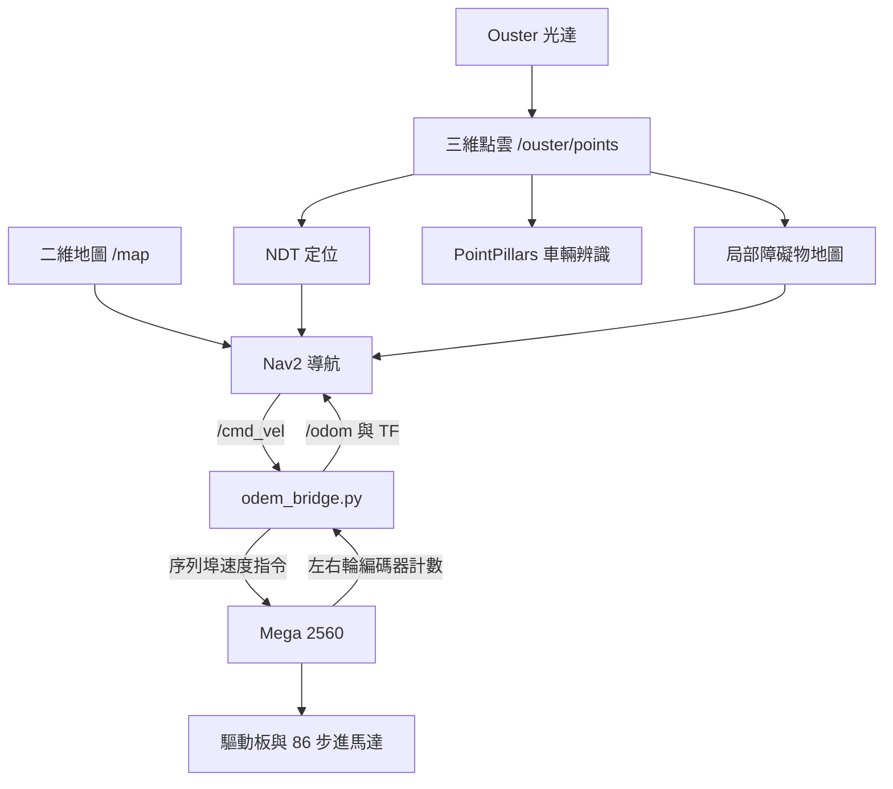
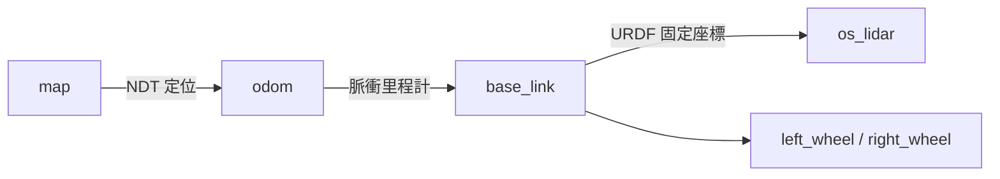

# 機器人控制系統架構

更新：2026-09-23，已納入 Mega 韌體、實車調校背景與歷史效能回報。原車已拆除，本 Markdown 整理當時設計與運行紀錄；既有 PDF 尚未同步此次補充。

## 一、系統組成與資料流

本專題以 NVIDIA Jetson AGX Xavier 作為 AMR 的上層運算平台，在 Ubuntu 20.04 上使用 ROS 2 Foxy 串接光達感知、定位、導航與底盤控制。硬體包含 Ouster OS1 32s 光達（原報告記載）、Arduino Mega 2560、馬達驅動板及 JMC 86J18156EC-1000-LS-01 閉環步進馬達，馬達輸出軸直徑為 14 mm。Jetson 根據光達資料與導航目標計算車體速度，將指令傳送至 Mega，再由 Mega 控制驅動板帶動馬達，使車輛完成前進與轉向。

光達資料分別提供定位、障礙物感知及車輛辨識使用。定位節點將即時點雲與事先建立的三維地圖配準，取得車輛在地圖中的位置；Nav2 結合此位置、二維地圖與周圍障礙物，產生線速度及角速度。底盤同時回傳左右輪編碼器累積計數，由 Jetson 換算里程計，形成導航與底盤之間的資料回授。

圖：AMR 感知、導航與底盤控制資料流。車輛辨識與導航共用光達資料，各自執行不同任務。

主要程式分工如下。各腳本負責啟動對應節點，節點之間透過 ROS 2 Topic 與 TF 傳遞資料。

| 程式 | 使用技術與主要功能 |
|---|---|
| odem_bridge.py | 訂閱速度指令、序列通訊、差速里程計；發布 odom → base_link。 |
| myagv.sh | 啟動 robot_state_publisher，依 URDF 發布車體、光達與車輪的相對座標。 |
| lidar.sh | 啟動 Ouster 驅動，接收三維點雲，使用 ROS 系統時間。 |
| local.sh | 啟動 NDT 點雲定位，發布 map → odom 與定位姿態。 |
| nav1.sh | 啟動 Nav2，執行路徑規劃、路徑追蹤與導航狀態管理。 |
| map.sh | 啟動地圖伺服器與生命週期管理，發布二維佔據網格地圖。 |

<!-- PAGEBREAK -->

# 座標系統與定位原理

## 二、車體模型與 TF 座標轉換

系統以 map 表示全域地圖座標，odom 表示連續累積的里程計座標，base_link 表示車體座標。myagv.sh 載入 myagv.urdf，定義光達 os_lidar 及左右車輪相對於車體的位置。這些固定安裝關係與定位、里程計提供的動態關係，共同組成完整 TF 樹。

圖：主要 TF 關係。map → odom 由定位節點發布，odom → base_link 由里程計橋接程式發布。

URDF 中光達相對車體的位置設為 x = -0.375 m、y = 0 m、z = 1.122 m；此數值屬於車體座標系中的安裝外參。各段 TF 應由指定節點負責，避免同一座標關係被重複發布。車體與 STL 原點 O 均為前方兩驅動輪觸地點連線中點；底部圖右側為前進方向及 +x。圖示外框約 955 × 902 mm，前後界為 x = 0.142501／−0.812499 m，左右界為 y = ±0.451 m。現有 Nav2 footprint 軸向與此定義不符，修正參考及校正待辦見 [硬體與韌體](硬體與韌體.md)。

## 三、左右輪編碼器里程計

odem_bridge.py 讀取 Mega 回傳的左右輪編碼器累積計數，以輪徑、輪距及每輪一圈對應的脈衝數換算行進距離。左右輪位移的平均值代表車體前進距離，兩輪位移差則用於估計轉向角度，累積後得到平面位置與朝向，並發布 /odom 及 odom → base_link。

實車使用內建 1000 線編碼器的閉環步進馬達，驅動器設定為 1600 細分。Mega 以中斷讀取左右編碼器並回傳累積計數。Mega 與 Jetson 現有設定均為輪徑 0.26 m、輪距 0.85 m；Jetson 仍以每輪一圈 1600 個有效計數換算里程計。使用者說明大部分參數曾依實車情況調整，本文保留原部署值。編碼器每輪有效計數與命令細分屬不同量，個別倍率校正紀錄未留存；條件式推算另記於硬體文件，不作為已量得的里程計誤差。

實車驅動輪標稱為 10 英吋（0.254 m），程式則使用 0.26 m 的部署值；兩者分別記錄。因車輛已拆除且個別校正過程未完整留存，不僅憑此差異判定程式值錯誤。Mega 約每 50 ms 以上回報一次計數，屬約 20 Hz 等級；Jetson 的資料讀取與 TF／odom 發布計時器各設為 50 Hz，可能重複發布上一筆狀態，不能當成 50 Hz 新量測。

## 四、NDT 定位與時間同步

local.sh 啟動 lidar_localization_ros2，使用 NDT_OMP 將即時三維點雲與既有 PCD 地圖配準。NDT 以空間網格內的點分布描述環境，搜尋較符合地圖的車體姿態，再結合 odom → base_link 計算 map → odom，修正里程計長時間累積的偏移。此處的定位使用三維點雲地圖；map.sh 發布的二維地圖則供導航規劃使用。

| 定位參數 | 現有設定 | 調整目的 |
|---|---|---|
| NDT 網格解析度／最大迭代次數 | 3.5 m／20 次 | 平衡配準尺度與計算量。 |
| 點雲降採樣／使用距離 | 0.3 m／0.5~25 m | 減少點數，限制參與定位的距離範圍。 |
| 局部地圖半徑／姿態發布頻率 | 30 m／10 Hz | 限制搜尋區域並定期提供定位結果。 |

lidar.sh 設定 timestamp_mode = TIME_FROM_ROS_TIME，並採用 use_sim_time = false，讓實車資料使用 ROS 節點的系統時間，降低光達與 TF 時間基準不同造成的查詢問題。定位 10 Hz、橋接 50 Hz 與下述控制器 5 Hz 均為設定值。依團隊對先前實車測試的回報，點雲 topic 發布頻率約為 3.75 Hz，車輛辨識平均更新率高於 1 Hz。辨識精確數值已無法確定；目前未取得完整原始量測日誌與條件紀錄，故以歷史近似紀錄呈現，不能據此推定定位更新率或效能瓶頸。

<!-- PAGEBREAK -->

# 導航演算法與馬達控制

## 五、Nav2 路徑規劃與障礙物處理

nav1.sh 啟動 Nav2 並載入 my_nav2_params.yaml。全域成本地圖以 map.sh 提供的二維佔據網格為基礎，加入障礙物膨脹區，讓路徑規劃保留車體通行空間。局部成本地圖使用隨車移動的 6 m × 6 m 視窗，透過 VoxelLayer 直接接收 /ouster/points，將周圍三維障礙物轉為導航成本。

全域規劃器採用 NavFn，設定 use_astar = false，使用 Dijkstra 搜尋路徑。路徑追蹤採用 Regulated Pure Pursuit，根據前視目標計算轉向，並啟用依路徑曲率調整線速度的功能。行為樹負責協調規劃、追蹤與異常處理；設定中包含旋轉、後退與等待等恢復功能，實際執行順序由載入的行為樹決定。

| 導航參數 | 現有設定 | 調整目的 |
|---|---|---|
| 控制器更新頻率 | 5 Hz | 配合系統運算與底盤反應。 |
| 期望前進速度／前視距離 | 0.25 m/s／1.5 m | 設定巡航速度與路徑追蹤尺度。 |
| 局部成本地圖解析度／更新頻率 | 0.05 m／5 Hz | 平衡障礙物表示精度與更新負載。 |
| 障礙物高度／標記最大距離 | 0.15~2.0 m／4.0 m | 限定納入局部成本地圖的點雲範圍。 |
| 膨脹半徑：局部／全域 | 1.15 m／0.7 m | 在障礙物周圍建立規劃成本緩衝區。 |
| 到點位置／朝向容許誤差 | 0.5 m／0.26 rad | 定義導航完成的判斷條件。 |

成本地圖另以 footprint 描述車體外形，供碰撞判斷使用。團隊確認兩個檔名對應不同場地的地圖，並曾使用室內與室外場景；各檔名對應哪一場景尚未明示。現有 map.sh 指向的 mymap.yaml 解析度為 0.12 m/pixel，另一份 my_map.yaml 為 0.07 m/pixel；兩者均與局部成本地圖的 0.05 m 設定屬於不同層級。未來重建時須使所選地圖、NDT 點雲地圖及禁停區標註共用一致座標基準。資料夾另有 laser.sh 可將點雲轉為 /scan，但目前主要導航設定直接使用三維點雲。

## 六、Jetson、Mega 與馬達驅動板

Nav2 將車體線速度與角速度發布至 /cmd_vel。odem_bridge.py 以 115200 bps 的序列通訊，將速度封裝為 V線速度,角速度 加上換行字元，送至 Mega 2560。依本系統硬體架構，Mega 以差速運動學換算左右輪速度，透過 AccelStepper 的 STEP／DIR 訊號控制驅動板，驅動左右側 86 步進馬達。韌體以 run() 配合目標位置與速度上限執行加減速，加速度設為 50 steps/s²，右輪輸出反號以配合安裝。

差速底盤透過左右輪速度差完成轉向：兩輪同速時直行，兩輪不同速時改變行進方向。Mega 回傳的 P左輪計數,右輪計數 由橋接程式解析，再提供 /odom 與 TF 給導航系統使用。上層導航負責決定車體如何移動，Mega 與驅動板則負責執行馬達動作。韌體設有超過 500 ms 未收到速度指令即令目標速度歸零的分支；實際停止時間仍受迴圈與加減速影響，尚未在本次驗證。Mega 將編碼器資料供里程計使用，未另以編碼器誤差實作 PID。

<!-- PAGEBREAK -->

# 光達車輛辨識與控制整合

## 七、車輛辨識技術與參數調整

車輛辨識節點與定位、導航共用 /ouster/points，使用 OpenPCDet 中的 PointPillars 與 nuScenes 預訓練權重辨識汽車、卡車及巴士。點雲先經 NumPy 解包、ROI 範圍裁切、強度正規化及高度修正，再補入模型需要的第五維時間特徵，交由模型推論三維車輛框。

為降低道路環境中的誤判，程式對候選框加入車種尺寸、長寬比及朝向限制，再以中心距離 NMS 抑制重複框，透過跨幀追蹤累積命中次數後發布結果。此篩選方式以路側近似平行停放的車輛為主要對象，也可能排除斜停或橫向車輛。Jetson 端另限制 PyTorch CPU 執行緒數，並提供 NumPy 體素化備援路徑，以配合嵌入式平台部署。

| 辨識參數 | 程式設定 | 用途 |
|---|---|---|
| ROI 範圍 | X：-10~15 m；Y：-12~12 m；Z：-2.5~3 m | 篩選巡檢附近點雲。 |
| Z 軸高度修正 | 0.57 m | 推論前下移點雲，輸出框再加回。 |
| 辨識信心門檻 | 程式預設 0.1；實車手動設為 0.4 | 篩除低信心候選框；0.4 為使用者確認的上路設定。 |
| 幾何及朝向篩選 | 高度至少 1.15 m；長寬比至少 1.3；朝向夾角約 45° 內 | 配合路側車輛外形與方向。 |
| 重複框中心距離 | 1.5 m | 同類別且相近的框保留高分者。 |
| 追蹤確認／容許失配 | 累積命中 5 次／超過 3 幀失配移除 | 抑制短暫偵測，保留跨幀關聯。 |

實車上路將通用及 car、truck、bus 四項信心門檻皆設為 0.4，原始碼預設保留 0.1。實際設定指令與含 ROI、高度修正及 sync_time_stamp=true 的 [部署 YAML](../config/vehicle_detector.yaml) 已保存，啟動時須明確載入。追蹤器的命中次數在短暫失配時不會歸零，因此此處採「累積命中」描述。

## 八、辨識結果與巡檢功能的銜接

辨識節點發布 /detected_vehicles，保留輸入點雲的座標框架資訊；sync_time_stamp=true 會在 callback 開始將時間戳改為節點當下時間，並不消除運算延遲。違停判定節點利用 TF 將車輛位置轉到 map，依 zones.yaml 定義的禁停區進行幾何比對，取車輛中心與四個角點作為採樣位置，再搭配停留時間確認及重複事件抑制。現有確認時間為 3 s、事件冷卻時間為 30 s，屬於專題巡檢事件的工程設定。

判定節點可發布視覺化標記、相機觸發訊息及 /violation/nav_target 觀測目標點。目標點仍需由任務節點轉為 Nav2 導航請求，現有主要流程尚未確認此介面已接通，因此不將其描述為已完成的自動靠近拍攝功能。

本控制系統的整合重點為光達與 TF 時間一致性、車體幾何校正、NDT 配準尺度、導航速度與障礙物成本設定，以及辨識前後處理參數。程式參數多依當時實車情況調整，本文保留其部署設定；效能回報與設定頻率分開呈現。原車現已拆除，定位精度、避障成功率及辨識準確率等未留存完整量化紀錄，因此本文不提出這些指標的數值結論。歷史測試的來源與限制見 [歷史實車測試紀錄](歷史實車測試紀錄.md)。

## 九、室外導航測試的限制與後續分析

室外測試曾發生車輛無法移動，修改地圖檔名後仍未排除。保存的 [啟動紀錄](../fish/ros2_ws/run.md) 是里程計、車體模型、光達、點雲轉掃描、定位、Nav2、自製介面，再啟動二維地圖。後續依 ROS 2 Foxy 官方原始碼分析，導航啟動檔的 map 引數並未直接載圖。地圖訂閱持久性雖有被 launch 覆寫的設定問題，但紀錄為導航先、地圖後，故不能優先歸因於導航晚加入漏收。應繼續核對定位的實際 PCD、初始位姿、TF 及導航輸出；原車已拆除且缺少故障當次完整日誌，目前不能宣稱已確認或修復單一歷史根因。證據與資料流詳見 [室外導航調查](室外導航無法移動_調查報告.md)。
