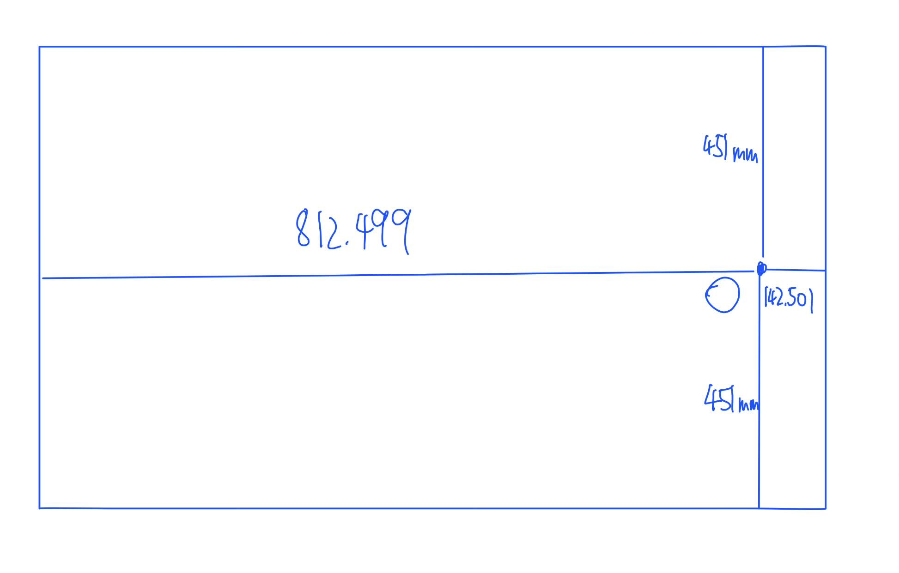
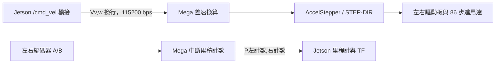

# 硬體、Mega 韌體與實車設定

更新：2026-09-23。來源為使用者本次補充、底部尺寸圖及 [Mega 原始碼](../firmware/mega2560/final_copy_20260923083515/final_copy_20260923083515.ino)。本文件區分使用者確認、程式設定及待驗證事項；未改動控制程式或燒錄實車。

原車已拆除。使用者說明大部分程式參數曾依實車情況調整，本文件保留部署值與靜態對照，不以補測作為文件完成條件。個別參數的校正過程未完整留存，詳見 [歷史實車測試紀錄](歷史實車測試紀錄.md)。

## 已確認的實車資訊

- 主機為 NVIDIA Jetson AGX Xavier，使用 Ubuntu 20.04 與 ROS 2 Foxy，已由使用者確認；JetPack 與 GPU 軟體版本尚待補記。
- 原專題 PDF 第 8 頁記載 Ouster OS1，第 15 頁進一步寫為 OS1 32s；光達硬體修訂與韌體版本仍待補記。
- 86 步進馬達採閉環編碼器回授。Mega 韌體確實讀取編碼器 A/B 訊號，將累積計數傳回 Jetson；不是把已發送的 STEP 脈衝直接當作量測值。
- 使用者確認編碼器內建於馬達、解析度為 1000 線；原廠資料未列獨立編碼器型號。驅動器設定為 1600 細分。編碼器線數、解碼後計數與馬達命令脈衝數分別記錄，不能直接互換。
- 原專題 PDF 第 11 頁的馬達型號為 JMC `86J18156EC-1000-LS-01`；使用者確認 14 mm 為輸出軸直徑，亦與同型號原廠圖面一致。原廠搭配驅動器為 `2HSS86H-A`，實車附貨型號仍未確認；規格、接線資料與來源見 [馬達與驅動器資料查核](馬達與驅動器資料查核.md)。
- 驅動輪標稱直徑 10 英吋，換算為 254 mm。程式中的 260 mm 保留為當時部署設定；個別校正過程未留存，不能只因與標稱值不同就判定錯誤。
- 車體幾何與 STL 原點均為圖中的 O，即前方兩驅動輪觸地點連線中點；圖中右側為前進方向及 +x。
- 實車上路時手動將辨識信心門檻設為 0.4；原始程式預設仍為 0.1。
- 使用者確認追蹤採「累積命中」、違停參數依目前程式，以及辨識輸出沿用點雲座標框架的說明；`sync_time_stamp=true` 時會改寫時間戳，詳見末節。
- 使用者回憶先前點雲 topic 發布約 3.75 Hz，辨識平均更新率高於 1 Hz；辨識精確值記不清約為 1 或 1.5 Hz。未保留完整日誌、量測條件、延遲或 CPU/GPU 負載，不將回憶寫成精確 benchmark。

## 車體尺寸與座標



依圖上標註讀取，單位為 mm：

| 幾何項目 | 尺寸／定義 |
|---|---|
| 原點 | 前方兩驅動輪觸地點連線中點 |
| 圖中原點至左側外框 | 812.499 mm |
| 圖中原點至右側外框 | 142.501 mm |
| 原點至圖中上下外框 | 各 451 mm |
| 圖示矩形總長／總寬 | 955 mm／902 mm |
| 驅動輪標稱直徑 | 10 英吋 = 254 mm |
| 馬達輸出軸直徑 | 14 mm；與驅動輪直徑分開記錄 |

使用者已確認圖中右側為車頭／+x，STL 原點就是 O。URDF 的 STL visual 使用零位移、零旋轉，因此模型沿用此座標定義。依所提供矩形外框，`base_link` 平面範圍為 `x ∈ [-0.812499, 0.142501] m`、`y ∈ [-0.451, 0.451] m`。方向不再是待確認假設。

現有 Nav2 局部與全域 footprint 均為：

```text
[[0.451, 0.8125], [0.451, -0.1425],
 [-0.451, -0.1425], [-0.451, 0.8125]]
```

它的 x 範圍為 ±0.451 m、y 範圍為 -0.1425 至 0.8125 m，與已確認的前進軸相差 90° 的配置關係，應列為既有設定不一致。依尺寸圖推導的矩形參考值如下；尚未套用到導航 YAML，僅供未來重建時核對局部／全域成本地圖及突出物覆蓋範圍；原車已拆除，不要求現在補測。

```yaml
footprint: "[[0.142501, 0.451], [-0.812499, 0.451], [-0.812499, -0.451], [0.142501, -0.451]]"
```

橋接程式以 `linear.x` 作前進。幾何方向已確認，剩下的是將設定、實際外形與 RViz 顯示對齊。

902 mm 是圖示外框寬，**不能直接當作兩驅動輪觸地點間距**。目前韌體與 Jetson 皆使用輪距 850 mm，URDF 輪中心距則為 820 mm；圖中未另外標輪距。URDF 的車輪視覺半徑 75 mm 也與 10 英吋輪徑不同，需將視覺模型與運動學校正分開核對。

## Mega 的控制與回授資料流



Mega 將線速度 v 與角速度 w 換為左右輪速度 `vL = v - wL/2`、`vR = v + wL/2`，再用 `steps/s = 輪速 × stepsPerRev / (π × wheelDiameter)` 產生驅動命令。右輪命令在輸出前反號，以配合安裝方向；編碼器左右計數的符號邏輯也不同，實車前進時原本應核對兩者同為正向；現未留存對應測試紀錄。

韌體使用 AccelStepper 的 `DRIVER` 模式，以 `setMaxSpeed()`、遠端相對目標及 `run()` 執行加減速。註解提到 `runSpeed()`，但實際呼叫的是 `run()`；報告依實際程式敘述。這些 API 的意義可參考 [AccelStepper 官方文件](https://www.airspayce.com/mikem/arduino/AccelStepper/classAccelStepper.html)。

| 訊號 | 左側 Mega 腳位 | 右側 Mega 腳位 |
|---|---:|---:|
| STEP | 6 | 8 |
| DIR | 7 | 9 |
| 編碼器 A | 2 | 20 |
| 編碼器 B | 3 | 21 |

這是程式腳位表。使用者確認依官方接線；現已找到原廠配套候選的端子與細分表，見 [接線資料查核](馬達與驅動器資料查核.md)。仍缺實車驅動板完整型號、編碼器分接 Mega 的接法、供電／電平、電流及 ENA／ALARM／停止線路。此韌體未使用編碼器誤差去調節 STEP 命令，因此不能描述為「Mega 上另有編碼器 PID 閉環」；硬體閉環細節需由驅動板型號與接線確認。

## 參數與時間行為

| 項目 | 目前程式設定 | 如何理解 |
|---|---|---|
| 輪徑／輪距 | Mega 與 Jetson 都是 0.26 m／0.85 m | 與標稱輪徑及實測尺寸分開記錄。 |
| 編碼器解析度 | 馬達內建，使用者確認 1000 線；所查資料未列獨立型號 | 解碼後計數還取決於邊緣計數方式、訊號來源與傳動比。 |
| 馬達命令細分 | 使用者確認 1600 細分；Mega `stepsPerRev=1600` | 程式作每圈 1600 個 STEP 命令換算，不是編碼器每圈 1600 計數；設定單位與傳動比仍需核對。 |
| 里程計計數倍率 | Jetson `ppr=1600` | 與 1000 線加 A 雙邊緣解碼的推算可能不符，見下節；本次保留程式設定。 |
| 編碼器解碼 | A/B 都註冊 CHANGE 中斷，但僅 A 改變時計數 | 依程式邏輯是 A 雙邊緣計數，不能稱為 A/B 四倍頻。 |
| 馬達加速度 | 50 steps/s² | AccelStepper 設定，非車體 50 m/s²。 |
| 初始最大速度 | 20000 steps/s | 迴圈依輪速再次覆寫；不是已驗證可達速度或始終有效的固定上限。 |
| 計數回報 | `millis() - lastOdomTime > 50` | 約 20 Hz 等級，正常情況也非精確 50 ms；阻塞可使其更慢。 |
| Jetson 讀取／發布 | 各 50 Hz 計時器 | 可以重複發布上次狀態，不代表 50 Hz 新編碼器量測。 |
| 指令逾時 | 超過 500 ms 將 v、w 歸零，目標設為目前步數位置 | 是軟體逾時處理；實際停止延遲／距離待量測，非硬體急停。 |

以目前輪徑和細分換算，0.25 m/s 約需 490 steps/s；若從靜止以 50 steps/s² 理想加速，約需 9.8 s。這只是設定值的估算，可解釋「反應慢」的可能來源之一，不能據此診斷光達、NDT 或辨識更新率。

### 1000 線與里程計倍率的關係

韌體只有在 `curA != lastA` 時改變計數，即使 A、B 都觸發中斷，也不是對兩相的全部邊緣計數。**若 1000 線表示編碼器軸每轉一圈，A 相有 1000 個完整週期，且 Mega 收到的是未分頻的原始 A/B 訊號，則目前程式理論上每個編碼器軸圈計 2000 次。**

令 R 為「車輪轉一圈時編碼器軸轉的圈數」，則理論有效計數為 `2000 × R` 次／輪圈。只有在 R=1 且無訊號分頻時，才能推定 Jetson 的 `ppr` 應為 2000。原車已拆除，原參數多經實車調整但個別校正過程未留存，因此保留 `ppr=1600` 作部署紀錄，不直接套用理論值。

若上述條件成立而仍用 `ppr=1600`，在輪徑等其他條件相同時，編碼器換算的輪位移會成為正確值的 `2000/1600=1.25` 倍，即高估 25%。這是條件式推算，不是已量測的誤差，也不是更新率不佳的直接證據。

編碼器已確認內建於馬達，剩餘關鍵是馬達至車輪的傳動比、Mega 取樣接法／訊號是否分頻，以及左右車輪各實轉一圈的計數差。原廠配套候選驅動器採四倍頻，但 Mega 現有程式仍是 A 雙邊緣，兩者計數不能混用。獨立編碼器型號查無資料不妨礙描述架構；有效輪圈計數及電氣接法目前記為無法補測的歷史資料缺口；未來重建時再對新硬體校正。

### 原始碼保留的時序檢查方向（供未來重建）

1. `Serial.parseFloat()` 會等待輸入，韌體未設定自訂 timeout；指令不完整時可能阻塞主迴圈，延後 `run()`、回報和逾時檢查。Arduino AVR 的 Stream 預設等待時間為 1000 ms，實際還需確認編譯所用核心版本。[Arduino Stream 原始碼](https://github.com/arduino/ArduinoCore-avr/blob/master/cores/arduino/Stream.cpp)、[預設值定義](https://github.com/arduino/ArduinoCore-avr/blob/master/cores/arduino/Stream.h)
2. 計數是中斷更新的 `volatile long`，傳送時未先取得受保護的左右計數快照；需檢查讀取一致性，避免把異常跳值當作運動。
3. Jetson 使用 `timeout=0` 的 `readline()`，未保留不完整行；解析例外又被忽略，可能丟掉半行資料。累積計數雖可在後續補回位移，時間與速度估計仍可能受影響。
4. Jetson 每次發布用當下時間戳，即使尚無新計數也會重發狀態；應分別量測新計數到達率、ROS 發布率及感知／定位耗時。

以上是供未來重建時參考的原始碼檢查方向，沒有宣稱已找到當時效能瓶頸；原車已拆除，不列為目前必須完成的實車測試。此次沒有改動韌體與橋接程式。

## 辨識門檻的重現方式

使用者已提供四項門檻的實際 `ros2 param set` 指令，並提供含 ROI、高度修正及時間戳設定的 YAML；現已保存為 [config/vehicle_detector.yaml](../config/vehicle_detector.yaml)。四個門檻皆為 0.4，程式原始預設仍為 0.1。設定內容不再列為缺件；啟動時須明確載入，使用方法見 [CONFIGURATION](CONFIGURATION.md)。

`sync_time_stamp=true` 時，程式在點雲 callback 開始以節點目前時間覆寫 `header.stamp`，之後將這個時間戳傳給辨識結果；`header.frame_id` 仍保持輸入點雲的座標框架。這不是重新量測時間，也沒有消除傳輸或推論延遲，因此不可用這個重寫後的 stamp 直接聲稱量得感測器端到端延遲。

舊辨識 launch 內的 map、靜態 TF、localizer 段落，使用者說明是筆電測試時另建、搬到實車後留下的內容；主線仍由既有地圖、NDT 與 odom bridge 負責。檔案中 Node 宣告已註解，但三段 parameters 內容未完整註解，故現有複本仍有語法錯誤。其角色已釐清，後續可整理舊入口，而非為它再增加一組實車定位。
