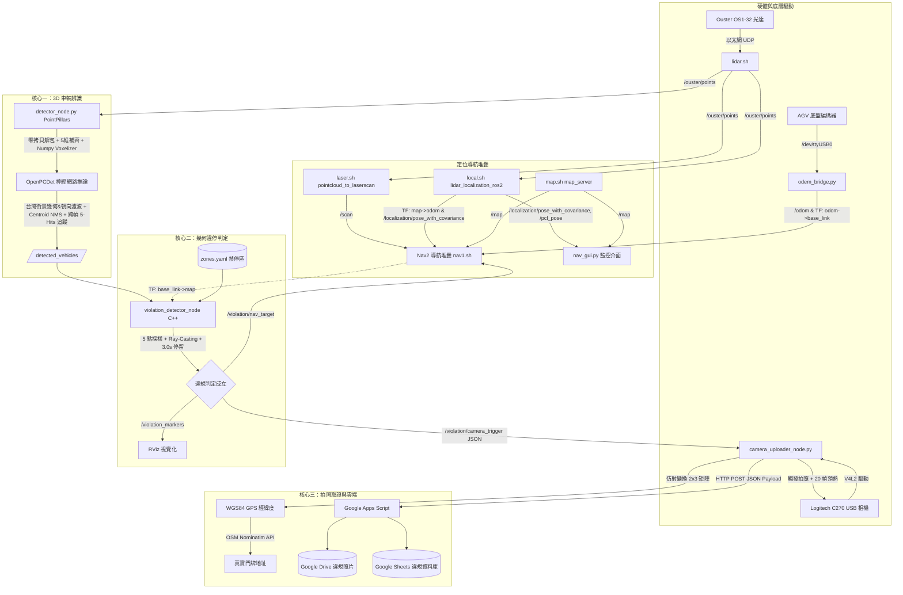

# 自走車 3D 光達路邊違規停車巡檢與雲端取證系統 — 專題技術報告

---

## 一、 系統總體架構與資料流向

整套巡檢系統分為兩大階段：前段**「自走車自主導航與環境感知基底」**與後段**「3D 車輛辨識、空間違停判定與雲端取證閉環」**。

| 階段 / 模組 | 組件與驅動 | 處理內容與資料流 |
|---|---|---|
| **前段：自主導航與環境感知** | **AGV 底盤編碼器** | 透過 `odem_bridge.py` 讀取，計算差速運動學並發布里程計 `/odom` 與 TF (`odom` ➔ `base_link`) |
| | **Ouster OS1-32 LiDAR** | 透過 `lidar.sh` 輸出 3D 原始點雲 `/ouster/points` |
| | **激光切片轉換** | 透過 `laser.sh` 將 3D 點雲投影降維為 2D 激光掃描 `/scan` |
| | **定位與地圖託管** | `local.sh` (`lidar_localization_ros2`) 配準點雲產生 `/localization/pose_with_covariance` 與 TF (`map` ➔ `odom`)；`map.sh` 發布佔據網格 `/map` |
| | **導航與監控介面** | Nav2 (`nav1.sh`) 載入 `my_map.yaml` 進行自主導航路徑規劃；輕量化 GUI (`nav_gui.py`) 訂閱地圖與定位狀態 |
| **後段：辨識、違停判定與雲端取證** | **【核心一】3D 車輛感知**<br>`pub_model_vehicle_detector` | • 二進制零拷貝解包 (`np.frombuffer`)、5 維張量適應與時間戳同步<br>• OpenPCDet (PointPillars, nuScenes 預訓練權重) + 原生 Numpy Voxelization<br>• 台灣街景專屬 5 道幾何尺寸約束與 Yaw 平行朝向濾波<br>• Centroid NMS 與 3D 跨幀軌跡關聯追蹤（`TRACK_MIN_HITS=5` 連續命中過濾）<br>• 預設門檻 0.1，實車部署透過 runtime 參數調整為 0.4 濾除假陽性<br>• 輸出 3D 框至 `/detected_vehicles` |
| | **【核心二】空間違停判定**<br>`violation_detector_node` (C++) | • 載入 `zones.yaml`（禁停區多邊形頂點）<br>• TF2 幾何校正：將車身中心與 4 個角點轉為全域地圖坐標 (`map`)<br>• 5 點採樣 + 膨脹容差（`zone_buffer_m_`）+ Ray-Casting 射線判定法<br>• 跨幀 Nearest-Neighbor 關聯 + EMA 質心平滑追蹤（`tracked_vehicles_`）<br>• 停留 > 3.0s 判定違規，30s 冷卻防重複（`confirmed_records_`）<br>• 發布 `/violation_markers`、`/violation/nav_target` 與 `/violation/camera_trigger` |
| | **【核心三】雲端上傳與取證**<br>`camera_uploader_node.py` | • 自動探測 `/dev/v4l/by-id/` 外接相機 + 20 幀 AE/白平衡預熱 + 原生品質轉 Base64<br>• 2x3 仿射變換矩陣：地圖像素坐標 (px, py) 精確換算 WGS84 GPS 經緯度<br>• OSM Nominatim API 逆向地理編碼反查真實門牌地址<br>• HTTP POST 打包發送 Google Apps Script (同步寫入 Drive 違規相片與 Sheets 資料庫) |



---

## 二、 完整 12 步啟動指令與管線職責對照表

> **路徑備註說明**：
> - **Jetson 原機目錄**：底盤與導航位於 `/home/ntust/ros2_ws/` 及 `/home/ntust/ous/`；核心三大模組位於 `/home/ntust/fish/ros2_ws/`。
> - **備份對照目錄**：`/home/fish/桌面/project/ntust/` 為 Jetson 環境之完整備份鏡像。

| 順序 | 執行指令 / 腳本 | 目錄位置 | 核心功能與資料流職責 | 主要 Topic & TF |
|:---:|---|---|---|---|
| **1** | `source fix.sh` | `~/ros2_ws` | **實體網卡通訊配置**：強制將 `eth0` 網卡鎖定在 100Mbps 全雙工、關閉自動交涉，確保與 Ouster 光達直連通訊穩定不掉包。 | 底層 Linux 硬體介面 (`eth0`) |
| **2** | `python3 odem_bridge.py` | `~/ros2_ws` | **底盤輪速計橋接**：透過 `/dev/ttyUSB0` 讀取雙輪編碼器 Pulse（PPR 1600、輪徑 0.26m、輪距 0.85m），計算差速運動學並發布里程計。 | • 發布 `/odom`<br>• TF: `odom` ➔ `base_link`<br>• 訂閱 `/cmd_vel` |
| **3** | `source myagv.sh` | `~/ros2_ws` | **機器人本體 TF 廣播**：啟動 `robot_state_publisher` 載入 `myagv.urdf`，定義車身結構、光達與傳感器安裝之幾何外參。 | 廣播 TF: `base_link` ➔ `laser_frame` / `os_sensor` |
| **4** | `source lidar.sh` | `~/ous` | **光達驅動連線**：連線 Ouster OS1 (IP: `169.254.70.240`)，以 ROS 系統時間戳對齊輸出 3D 原始點雲。 | 發布 `/ouster/points` (`sensor_msgs/msg/PointCloud2`) |
| **5** | `source laser.sh` | `~/ros2_ws` | **3D 點雲轉 2D 激光**：透過 `pointcloud_to_laserscan_node` 將 3D 點雲切片降維為單線 2D 掃描，供 Nav2 避障與定位使用。 | • 訂閱 `/ouster/points`<br>• 發布 `/scan` (`sensor_msgs/msg/LaserScan`) |
| **6** | `source local.sh` | `~/ros2_ws` | **全域點雲配準定位**：啟動 `lidar_localization_ros2`，配準預先建置的 PCD 地圖點雲，計算車身全域坐標，將 `/pcl_pose` 重映射為 `/localization/pose_with_covariance`。 | • 廣播 TF: `map` ➔ `odom`<br>• 發布 `/localization/pose_with_covariance`、`/pcl_pose` |
| **7** | `source nav1.sh` | `~/ros2_ws` | **Nav2 自主導航堆疊**：啟動 Costmap2D、BT Navigator、Planner Server、Controller Server，載入 `my_map.yaml` 進行巡檢路徑規劃。 | • 訂閱 `/scan`、`/tf`、`/map`<br>• 發布 `/cmd_vel` |
| **8** | `python3 nav_gui.py` | `~/ros2_ws` | **輕量化狀態監控介面**：使用 PySide6 + PyQtGraph 繪製 2D 佔據地圖與即時自走車位置，取代在 Jetson 上跑高負載 RViz2。 | • 訂閱 `/localization/pose_with_covariance`<br>• 訂閱 `/pcl_pose`<br>• 訂閱 `/map`、`/global_costmap/costmap` |
| **9** | `source map.sh` | `~/ros2_ws` | **2D 地圖伺服託管**：啟動 `nav2_map_server` 載入 `mymap.yaml`，透過 `nav2_lifecycle_manager` 自動完成 Configure & Activate，提供全域靜態地圖。 | 發布 `/map` (`nav_msgs/msg/OccupancyGrid`)、`/map_metadata` |
| **10** | `ros2 launch pub_model_vehicle_detector pub_model_detector.launch.py` | `~/fish/ros2_ws` | **【核心一】3D AI 車輛檢測**：點雲零拷貝二進制解包、補齊第 5 維，經 PointPillars 推論、台灣街景 5 重幾何朝向濾波、Centroid NMS 與 3D 追蹤器連續 5 幀驗證，發布 3D BBox（實車可覆蓋門檻至 0.4）。 | • 訂閱 `/ouster/points`<br>• 發布 `/detected_vehicles` (`vision_msgs/msg/Detection3DArray`)<br>• 發布 `/detected_vehicles_markers` |
| **11** | `ros2 run violation_detector violation_detector_node` | `~/fish/ros2_ws` | **【核心二】C++ 違規邏輯判定**：載入禁停區幾何多邊形，TF2 轉換車身 5 點採樣至全域坐標，以 `tracked_vehicles_` 狀態機追蹤駐留時間，發布取證觸發與側拍導航點。 | • 訂閱 `/detected_vehicles`、`/tf`<br>• 發布 `/violation_markers`、`/violation_zones_markers`<br>• 發布 `/violation/nav_target`<br>• 發布 `/violation/camera_trigger` |
| **12** | `python3 camera_uploader_node.py` | `~/fish/ros2_ws` | **【核心三】抓拍、GIS 換算與雲端上傳**：自動探測 USB 相機硬體路徑，20 幀預熱拍照，仿射換算真實 GPS 與反查真實地址，HTTP POST 傳送 Google 雲端。 | • 訂閱 `/violation/camera_trigger`<br>• 呼叫 OSM Nominatim API<br>• 發送 HTTP POST 至 Google Apps Script |

---

## 三、 核心工作區三大模組程式邏輯深剖 (`fish/ros2_ws`)

### 工作區目錄結構
```text
fish/ros2_ws/
├── src/
│   ├── pub_model_vehicle_detector/             # 【核心一】3D 深度學習目標偵測 (Python)
│   │   ├── launch/
│   │   │   └── pub_model_detector.launch.py    # 節點啟動檔 (定義 ROI、權重、門檻參數)
│   │   └── pub_model_vehicle_detector/
│   │       └── detector_node.py                # 推論節點 (零拷貝解包、Numpy Voxelizer、幾何&Yaw濾波、3D Tracker)
│   └── violation_detector/                     # 【核心二】空間幾何比對與違停狀態機追蹤 (C++)
│       ├── CMakeLists.txt
│       ├── include/violation_detector/
│       │   └── zone.hpp                        # Ray-Casting 點多邊形碰撞檢測演算法
│       └── src/
│           └── violation_detector_node.cpp     # 5點採樣、TF2 座標轉換、EMA 追蹤、冷卻去重、觸發發布
├── camera_uploader_node.py                     # 【核心三】USB 相機自動尋徑拍照、仿射換算 GPS、OSM 查地址、上傳 GAS
├── violation_area/
│   └── zones.yaml                              # 禁停多邊形區域標註 (GIMP 像素坐標頂點與解析度)
├── OpenPCDet/                                  # 3D 點雲神經網路推論框架 (相容 ARM 的 Voxelizer)
└── weights/
    └── pointpillar_nuscenes_50e.pth            # nuScenes 訓練的 PointPillars 模型權重
```

---

### 【核心一】3D 車輛辨識節點 (`pub_model_vehicle_detector`)

- **輸入**：`/ouster/points` (`sensor_msgs/msg/PointCloud2`)
- **輸出**：
  - `/detected_vehicles` (`vision_msgs/msg/Detection3DArray`)
  - `/detected_vehicles_markers` (`visualization_msgs/msg/MarkerArray`)
- **底層模型**：OpenPCDet 架構下的 PointPillars（設定檔：`cbgs_pp_multihead.yaml`，基於 nuScenes 訓練 50 個 Epochs 的預訓練權重）。

#### 關鍵技術機制

1. **點雲二進制零拷貝解包 (Zero-Copy Buffer) 與 5 維張量適應**
   - **高效率記憶體映射**：ROS 內建的 `read_points` 迭代器（generator）在 Python 中每幀耗時高達 100~200ms，是造成點雲延遲卡頓的最大瓶頸。本節點改寫為 `convert_pc2_to_numpy`，根據 `msg.fields` 的 offset 與資料類型動態建立 structured numpy dtype，直接透過 `np.frombuffer(msg.data, dtype=...)` 進行零拷貝記憶體對齊解包，處理時間暴降至 **2ms** 以內。
   - **5 維張量適應 (Domain Adaptation)**：nuScenes 訓練的 PointPillars 模型預期輸入特徵為 5 維 $[X, Y, Z, \text{Intensity}, \text{Timestamp}]$，而實體 Ouster OS1 原生僅有 4 維。節點在推論前自動以 `np.zeros((points.shape[0], 1))` 填補第 5 維時間矩陣，實現免重新訓練的零成本跨數據集遷移。
   - **時間戳重寫 (`sync_time_stamp: true`)**：可強制將點雲時間戳重寫為系統目前時鐘，解決離線播放 rosbag 測試或點雲時鐘飄移導致的 TF Extrapolation Error（座標轉換外推超時）。

2. **ROI 空間過濾、反射強度歸一化與 Z 軸安裝校正**
   - **空間立方體裁剪**：巡檢範圍限制於 $X \in [-10.0, 15.0]$、$Y \in [-12.0, 12.0]$、$Z \in [-2.5, 3.0]$（公尺），剔除遠端非道路噪點與近端車體回波。
   - **反射強度歸一化**：Ouster 的反射率 (reflectivity) 原始數值範圍較大 (0~255+)，而 nuScenes 訓練強度分佈為 $[0, 1]$。節點將強度數值除以 255.0 並 clamp 在 $[0.0, 1.0]$，完成分佈對齊。
   - **幾何高度校正 (`z_offset_correction: 0.57`)**：修正實車光達安裝高度與 nuScenes 虛擬訓練基準面的落差，將點雲向下虛擬平移後送入模型，推論後再將 3D Bounding Box 的 Z 軸高度加回還原。

3. **自製原生 Numpy Voxelization 回退機制**
   - Jetson AGX (ARM64) 平台的 CUDA、PyTorch 與 `spconv` 版本相容極為嚴苛，編譯或動態連結常引發 Core Dump 崩潰。
   - 原始碼在未偵測到 `spconv` 時，自動無縫切換到原生 Numpy 柱狀網格化生成（Pillar Generation），使神經網路完全擺脫特定 C++ 擴充套件相依性。

4. **邊緣端 CPU/GPU 資源隔離**
   - 強制鎖定執行緒數量：`os.environ["OMP_NUM_THREADS"] = "2"`、`torch.set_num_threads(2)`，防止 PyTorch 與 OpenMP 吃光 AGX 的 8 個 CPU 核心，保障定位（`local.sh`）與導航（`nav1.sh`）能即時運算。

5. **台灣街景專屬的 5 道幾何尺寸與朝向濾波 (Geometric & Heading Rule Base)**
   神經網路推論輸出候選框後、進入 Tracker 之前，節點實作了高度工程化的幾何先驗規則庫（`detector_node.py` L433-L469），精準清洗假陽性誤檢：
   - **高度門檻**：$dz \ge 1.15\text{m}$，直接剔除矮花圃、人行道緣石與安全島低矮障礙物。
   - **長寬比橫向約束**：$dy \le dx \times 1.25$，排除路邊橫向狹長物體（如整排緊密並排停放的機車群或橫條狀低矮灌木）。
   - **長形形狀約束**：要求長度至少為寬度的 1.3 倍（$dx \ge dy \times 1.3$），真實汽車必然呈現縱長矩形，藉此排除群聚行人、圓形花壇或方形大垃圾桶。
   - **車種尺寸常識約束**：
     - `car`：長 $dx \ge 3.3\text{m}$、寬 $dy \in [1.4, 2.2]\text{m}$、高 $dz \ge 1.30\text{m}$（精確對應台灣常見中小型房車與 Veryca 中華菱利等商用小貨車尺寸）。
     - `truck`：長 $dx \ge 4.0\text{m}$、寬 $dy \le 2.8\text{m}$。
     - `bus`：長 $dx \ge 6.0\text{m}$、寬 $dy \le 3.0\text{m}$。
   - **行進平行朝向約束 (Yaw Filter)**：
     - 計算車框航向角（Yaw）與自走車行進方向（X 軸）之夾角，只保留夾角小於 $45^\circ$（$0.785\text{ rad}$）的車輛。
     - **工程設計考量**：路邊違停車輛均為順向或逆向平行停放，此約束可強制濾除任何打橫、垂直於車道的誤判假框。

6. **同幀 Centroid NMS 與 3D 跨幀 Centroid Tracker**
   - **Centroid NMS**：當同一幀內兩車框的鳥瞰圖 (BEV) 中心距離小於 `NMS_DIST_THRESH = 1.5m` 且類別相同時，保留分數較高者，消除重疊框。
   - **動態跨幀關聯門檻**：計算前後幀時間差 $\Delta t$，將追蹤距離門檻動態調整為 `TRACK_DIST_THRESH = max(3.5, min(8.0, 15.0 * dt))`，防止車輛行駛或點雲跳幀時追蹤中斷。
   - **類別跳動容錯**：模型推論時常在 `car` 與 `truck` 之間震盪，Tracker 放寬類別嚴格一致性限制，只要空間距離最近即歸併為同一實體。
   - **連續命中過濾機制 (`TRACK_MIN_HITS = 5`)**：只有連續追蹤命中達到 5 幀的車輛，才會被確認（印出 `[NEW VEHICLE]`）並發布至 `/detected_vehicles`；若超過 `TRACK_MAX_AGE = 3` 幀遺失則移除軌跡。此機制澈底杜絕了點雲隨機噪聲引發的瞬間虛警。

7. **門檻過濾 (0.1 預設 vs. 0.4 Runtime 覆蓋)**
   - 原始碼與 Launch 檔內的預設參數為 `score_threshold: 0.1`。
   - 在戶外實車上路時，因道路環境反光、樹木雜物易引發低信心度誤判，在實際部署啟動時，可透過 ROS 2 命令列或 Launch 參數覆蓋為 `0.4`（例如 `-p score_threshold_car:=0.4`），針對 `car`、`truck`、`bus` 進行過濾，大幅提升實車穩定度。

---

### 【核心二】C++ 違規停車判定與空間追蹤節點 (`violation_detector_node`)

- **輸入**：`/detected_vehicles` (`vision_msgs/msg/Detection3DArray`)、TF 樹狀變換 (`tf_buffer_`)
- **輸出**：
  - `/violation_markers` (`visualization_msgs/msg/MarkerArray`)
  - `/violation_zones_markers` (`visualization_msgs/msg/MarkerArray`)
  - `/violation/nav_target` (`geometry_msgs/msg/PoseStamped`)
  - `/violation/camera_trigger` (`std_msgs/msg/String` JSON)
- **設定檔**：`violation_area/zones.yaml`

#### 關鍵技術機制

1. **禁停區多邊形空間映射**
   - `zones.yaml` 記錄標註地圖上的 2D 像素坐標 $(P_x, P_y)$。節點依地圖解析度（`resolution: 0.12`）與原點偏移（`origin: [-339.0, -141.0]`），換算為 ROS 世界坐標系 $(W_x, W_y)$：
     $$W_x = P_x \times \text{resolution} + \text{origin}_x$$
     $$W_y = (\text{ImageHeight} - P_y) \times \text{resolution} + \text{origin}_y$$

2. **動態時空座標轉換 (TF2)**
   - 感知節點發布的車輛坐標為自走車當前時間戳的 `base_link` 坐標。
   - 節點透過 `tf_buffer_->transform(...)` 查詢並內插瞬時 TF 變換矩陣，將車身中心坐標無縫轉換至靜態全域的 `map` 坐標系。

3. **5 點採樣判別 + 射線幾何判定法 (Ray-Casting)**
   - **5 點採樣與膨脹容差**：除了車輛中心點 $(c_x, c_y)$ 外，節點依車輛四元數計算偏航角 $\text{Yaw}$，並取車輛 BBox 4 個旋轉角點（加入 `zone_buffer_m_` 容差）。5 點中任一點落入禁停區即判定命中，有效解決「車身局部壓線但質心未入界」的邊界漏檢。
   - **Ray-Casting 演算法**（`zone.hpp`）：自待測點向水平正方向發射一條射線，統計與多邊形邊界的交點個數；奇數代表點在多邊形內部，偶數代表外部。

4. **空間追蹤容器 (`tracked_vehicles_`) 與 EMA 質心平滑**
   - 節點維護 `std::vector<TrackedVehicle> tracked_vehicles_` 結構。
   - 以歐氏距離（門檻 `track_dist_thresh_ = 2.0m`）進行跨幀 Nearest-Neighbor 匹配。
   - 匹配成功時以指數移動平均（EMA）平滑車身坐標：
     $$c_x^{\text{new}} = 0.7 \times c_x^{\text{prev}} + 0.3 \times c_x^{\text{curr}}$$
     $$c_y^{\text{new}} = 0.7 \times c_y^{\text{prev}} + 0.3 \times c_y^{\text{curr}}$$
     避免自走車移動時點雲配準輕微抖動導致追蹤位置劇烈跳動。

5. **違規狀態機確認與 30 秒冷卻去重佇列 (`confirmed_records_`)**
   - 當車輛在禁停區持續駐留時間 $\Delta t = \text{now} - \text{enter\_time} \ge \text{confirm\_duration\_}$（實測預設為 3.0 秒，正式營運可設為 3 分鐘），且尚未確認違規時，觸發違規事件。
   - **冷卻去重機制**：維護 `confirmed_records_` 佇列，若在半徑 2.0 公尺內且 30 秒冷卻時間（`violation_cooldown_sec_ = 30.0s`）內已有紀錄，則自動抑制觸發，防止重覆告警。
   - **多通道動作發布**：
     - 發布紅色立方體與違規文字標籤至 `/violation_markers`。
     - 發布車輛側邊平行觀測點至 `/violation/nav_target`（偏移 $c_x - 1.5\text{m}$），引導自走車移至最佳角度取證。
     - 發布 JSON 觸發事件至 `/violation/camera_trigger`：
       ```json
       {
         "vehicle_id": "#001",
         "zone_name": "KL Rd., 155 Ln.",
         "cx": 12.34, "cy": 56.78,
         "px": 2854.0, "py": 4415.0
       }
       ```

---

### 【核心三】邊緣抓拍、GIS 仿射變換與雲端上傳 (`camera_uploader_node.py`)

- **輸入**：`/violation/camera_trigger` (`std_msgs/msg/String` JSON)
- **硬體與外部介面**：USB 相機（Logitech C270 / USB WebCam）、OpenStreetMap Nominatim API、Google Apps Script (GAS) Webhook

#### 關鍵技術機制

1. **USB 相機動態尋徑、V4L2 驅動與 20 幀預熱**
   - **動態設備探測**：優先掃描系統 `/dev/v4l/by-id/` 目錄，自動抓取帶有 `C270`、`WEBCAM` 之硬體符號連結；若不存在則嘗試 `preferred_camera_id`（預設 2，ROS 參數預設為 0），並具備 0~4 索引回退機制，解決重開機後 `/dev/video*` 編號飄移的問題。
   - **20 幀熱身防過曝**：開啟相機後連續讀取 20 幀影像丟棄，讓感光元件的自動曝光 (Auto Exposure) 與白平衡穩定收斂，避免剛開啟相機時拍攝到過曝或全黑照片。
   - **原生無失真編碼**：保持相機原生解析度（不進行 Resize），以品質 95 壓制成 JPEG 後轉換為 Base64 字串。

2. **2x3 仿射變換矩陣 (SLAM 像素坐標 ➔ WGS84 地球經緯度)**
   - 在 SLAM 地圖與真實世界中標定 3 組無共線之基準控制點：
     - Source: 地圖像素坐標 $[P_x, P_y]$
     - Destination: 真實 WGS84 GPS 經緯度 $[\text{Lon}, \text{Lat}]$
   - 透過 OpenCV `cv2.getAffineTransform` 計算出 $2 \times 3$ 仿射矩陣 $M$：
     $$\begin{bmatrix} \text{Lon} \\ \text{Lat} \end{bmatrix} = M \begin{bmatrix} P_x \\ P_y \\ 1 \end{bmatrix}$$
   - 根據換算後的經緯度，即時組合出 Google Maps 導航連結（`https://www.google.com/maps/search/?api=1&query=lat,lon`）。

3. **逆向地理編碼 (Reverse Geocoding)**
   - 攜帶經緯度向 OpenStreetMap Nominatim 伺服器發送 HTTP GET 請求（設置合規 User-Agent），自動反查出台灣當地的真實街道與門牌地址（例如：`台北市大安區基隆路四段43號`）。

4. **物聯網事件打包與雲端多點寫入**
   - 產生具備唯一事件編號（`EVT-YYYYMMDDHHMMSS-XXXXXX`）的完整取證 Payload：
     ```json
     {
       "event_id": "EVT-20260922131500-a1b2c3",
       "timestamp": "2026/09/22 13:15:00",
       "zone_name": "KL Rd., 155 Ln.",
       "maps_url": "https://www.google.com/maps/search/?api=1&query=25.014694,121.543250",
       "address": "台北市大安區基隆路四段43號",
       "image_filename": "violation_20260922_131500.jpg",
       "image_base64": "/9j/4AAQSkZJRgABAQ..."
     }
     ```
   - 透過 HTTP POST 發送至 Google Apps Script Web App。後端自動將相片還原寫入 Google Drive，並在 Google Sheets 違規資料庫中新增一行紀錄，供 Web 儀表板（`violation-dashboard`）即時呈現。

---

## 四、 專題報告建議突顯之工程亮點與技術貢獻

1. **跨架構與異質語言解耦 (Heterogeneous Pipeline)**
   - 兼顧推論與即時性：高負載的 3D AI 偵測交給 Python + PyTorch CUDA，幾何碰撞與狀態機交給極致效能的 C++，底層通訊藉由 ROS 2 DDS 進程間通訊（IPC）完全解耦，不會互相拖慢。
2. **打通「空間坐標系全閉環」(Coordinate System Closed-Loop)**
   - 實現了從 **光達局部點雲座標 (`os_sensor`) ➔ 自走車底盤 (`base_link`) ➔ SLAM 地圖座標 (`map`) ➔ 像素平面 ➔ WGS84 真實地球 GPS** 的無縫坐標鏈投影。
3. **高韌性邊緣運算與動態調優 (Edge Resilience & Optimization)**
   - **原生 Numpy Voxelizer**：解決 Jetson ARM 架構與 `spconv` 的動態庫崩潰。
   - **二進制零拷貝記憶體解包**：以 `np.frombuffer` 取代 Python generator，解包耗時從 200ms 降至 2ms。
   - **多級濾波與狀態追蹤**：台灣街景 5 重幾何與朝向約束 + Centroid NMS + 5-Hits 門檻過濾 + TF 幾何 5 點採樣 + 30 秒冷卻去重，杜絕誤報。
   - **輕量化 GUI 與資源隔離**：鎖定 2 核心 CPU 執行緒防 starvation，並以基於 PySide6 / PyQtGraph 自行開發之輕量化監控介面 (`nav_gui.py`) 代替高負載的 RViz2。
4. **混合型感知架構 (AI Deep Learning + Physical Heuristics)**
   - 克服 nuScenes 預訓練模型在台灣非標準街景中的 Domain Gap：結合 5 維張量補齊、反射率強度歸一化、Z 軸安裝高偏差補償，並導入車體幾何常識（Veryca 小貨車長寬高比例）與車道平行停放（Yaw < 45°）硬約束，達到商用級別的高精準度與抗干擾能力。


